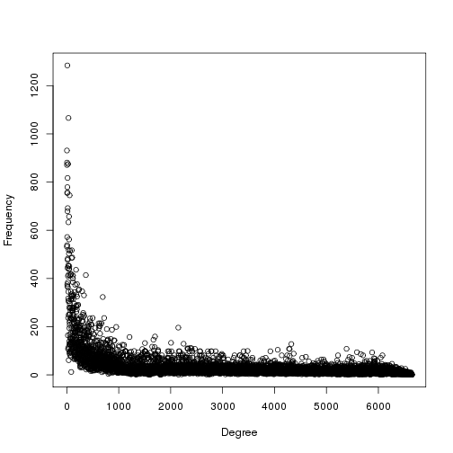
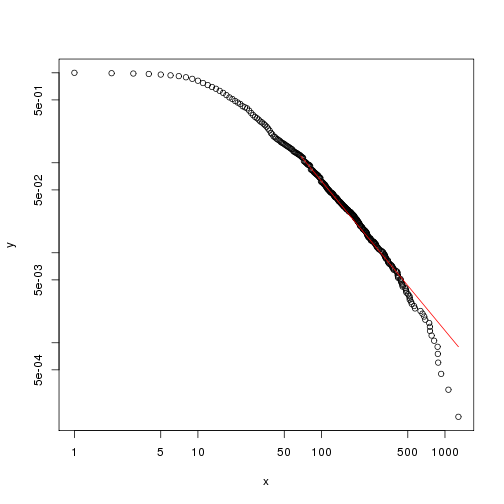
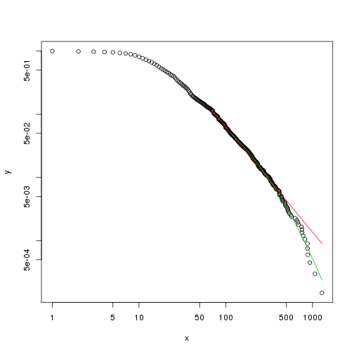
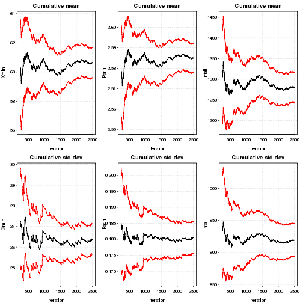
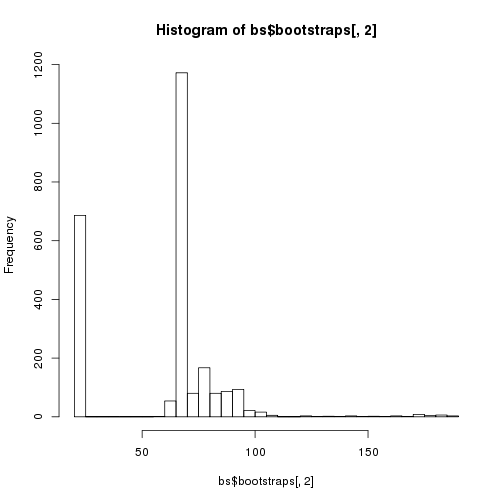
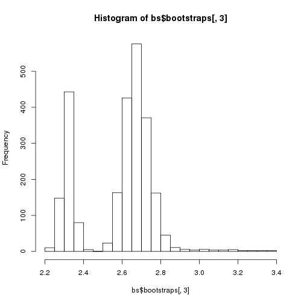
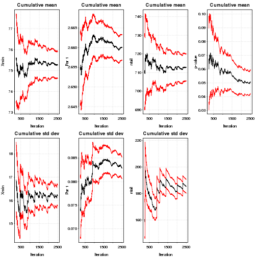

<h3>Μία πρώτη αναπαράσταση των δεδομένων (σε log-log plot)</h3>

Όπως γνωρίζουμε μία υποψήφια power law θα πρέπει να παρουσιάζει μία σχεδόν γραμμική σχέση σε ένα log-log plot εκτεινόμενη τουλάχιστον σε 2 τάξεις μεγέθους (τόσο στον άξονα των x, όσο και των y).
Ωστόσο, αυτό αποτελεί μία αναγκαία, αλλα όχι ικανή συνθήκη, που όμως έχει εσφαλμένα χρησιμοποιηθεί στο παρελθόν σε πολλές επιστημονικές εργασίες. <i>[Michael P. H. Stumpf  and Mason A. Porter, Critical Truths About Power Laws, Science, 2012, vol. 335, 665-666]</i> </br>


```
## Parsed with column specification:
## cols(
##   partner1 = col_character(),
##   partner2 = col_character(),
##   weight = col_integer()
## )
```



Θα εξετάσουμε αν η κατανομή των δεδομένων ακολουθεί την power law σύμφωνα με τον αλγόριθμο που προτάθηκε από τους Clauset, Shalizi και Newman <i>[Aaron Clauset, Cosma Rohilla Shalizi, and M.E.J. Newman, 2009, Power-Law Distributions in Empirical Data, SIAM Review 51, 661-703]</i>.</br></br>

Για το σκοπό αυτό θα χρησιμοποιήσουμε το πακέτο "poweRlaw" της γλώσσας προγραμματισμού R. <i>[Colin Gillespie, 2016, "poweRlaw: Analysis of Heavy Tailed Distributions"]</i>

<h3>Εκτίμηση των παραμέτρων $x_{min}$ και $α$</h3>


```r
est_pl<-estimate_xmin(pl_m)
est_pl$xmin
```

```
## [1] 68
```


```r
pl_m$setXmin(est_pl)
pl_m$getPars()
```

```
## [1] 2.656866
```

<h3>Η κατανομή των δεδομένων και το εκτιμώμενο μοντέλο</h3>

Η κόκκινη γραμμή απεικονίζει την εκτιμώμενη power law για την κατανομή.


```r
plot(pl_m);
lines(pl_m, col=2)
```




Για την προσαρμογή άλλων μοντέλων, ακολουθούμε την ίδια διαδικασία. Παρακάτω απεικονίζεται η προσαρμογή της power law και της log-normal στα δεδομένα μας.
Η πράσινη γραμμή απεικονίζει την εκτιμώμενη lognormal για την κατανομή</br>
Η κόκκινη γραμμή απεικονίζει την εκτιμώμενη power law για την κατανομή.</br>


```r
plot(ln_m)
lines(pl_m, col=2) 
lines(ln_m, col=3)
```



<h3>Bootstrap </h3>
Για να βρούμε τα περιθώρια λάθους στις εκτιμώμενες παραμέτρους χρησιμοποιούμε την μέθοδο bootstrap, η οποία ακολουθεί τον εξής αλγόριθμο:</br>

***
<i>Uncertainty in xmin</i>
***

    1:Set N equal to the number of values in the original data set
    2: for i in 1:B:
    3:  Sample N values from the original data set
    4:  Estimate xmin and α
    5:end for
    
***
</br>

Εάν θέλουμε το p-value να έχει ακρίβεια ε από την πραγματική τιμή, τότε πρέπει να παράξουμε τουλάχιστον $ \frac{1}{4} * ε^{-2} $ δείγματα. Δηλαδή για ακρίβεια 2 δεκαδικών ψηφίων για το p-value, έχουμε ε=0.01 και επομένως χρειαζόμαστε 2500 data sets.</br></br>

 Η μέθοδος bootstrap επιστρέφει 3 αποτελέσματα.

    1. **gof**
    Το στατιστικό από το Kolmogorov-Smirnov test (goodness-of-fit). Η τιμή αυτή  αντιστοιχεί στα αποτελέσματα της συνάρτησης estimate_xmin.
    2. **bootstraps**
    Aποτελεί ένα dataframe που περιέχει τα αποτελέσματα της μεθόδου.
    3. **sim_time**
    Ο μέσος χρόνος της προσομοίωσης για κάθε επανάληψη (σε sec.)

</br></br>

Παρακάτω εμφανίζουμε τα αποτελέσματα της μεθόδου για 10 από τις 2500 επαναλήψεις:


```r
num_threads<-strtoi(system("cat $PBS_NODEFILE| wc -l", intern = TRUE))
bs<-bootstrap(pl_m, no_of_sims=2500, threads=num_threads, seed=1)
```

```
## Expected total run time for 2500 sims, using 32 threads is 580 seconds.
```

```r
bs$bootstraps[1:10,]
```

```
##           gof xmin     pars ntail
## 1  0.03533081   67 2.662656   820
## 2  0.03778187   22 2.280921  3037
## 3  0.03617935   24 2.348397  2785
## 4  0.02989323   67 2.714118   790
## 5  0.03330962   24 2.320723  2768
## 6  0.02755976   78 2.614575   640
## 7  0.03326694   76 2.698743   651
## 8  0.03200555   78 2.742035   656
## 9  0.04098832   65 2.612855   873
## 10 0.03580708   24 2.324550  2698
```

```r
bs
```

```
## $gof
## [1] 0.02801375
## 
## $bootstraps
##             gof xmin     pars ntail
## 1    0.03533081   67 2.662656   820
## 2    0.03778187   22 2.280921  3037
## 3    0.03617935   24 2.348397  2785
## 4    0.02989323   67 2.714118   790
## 5    0.03330962   24 2.320723  2768
## 6    0.02755976   78 2.614575   640
## 7    0.03326694   76 2.698743   651
## 8    0.03200555   78 2.742035   656
## 9    0.04098832   65 2.612855   873
## 10   0.03580708   24 2.324550  2698
## 11   0.03309929   68 2.683481   764
## 12   0.03752216   66 2.684859   835
## 13   0.03370781   69 2.629042   776
## 14   0.03302977   67 2.725851   812
## 15   0.03608161   67 2.659285   798
## 16   0.03652524   24 2.316271  2722
## 17   0.03853419   67 2.677327   812
## 18   0.02848424   89 2.715229   523
## 19   0.03178644   68 2.611930   789
## 20   0.02829846   67 2.642301   807
## 21   0.02753960   25 2.418066  2673
## 22   0.03538073   73 2.658217   657
## 23   0.04005487   68 2.673158   813
## 24   0.02814104   70 2.710962   768
## 25   0.03763217   67 2.697018   791
## 26   0.03741986   24 2.319710  2795
## 27   0.03633182   77 2.648978   631
## 28   0.03015867   78 2.754829   612
## 29   0.03351759   68 2.707364   825
## 30   0.03653363   72 2.534518   707
## 31   0.03462610  100 2.795364   412
## 32   0.03990909   24 2.313323  2737
## 33   0.04403396   24 2.344085  2668
## 34   0.03677397   67 2.667613   788
## 35   0.03057988   68 2.618902   829
## 36   0.03702956   24 2.316687  2760
## 37   0.03404615   66 2.749468   796
## 38   0.03126706   66 2.640858   832
## 39   0.04020907  173 3.289246   190
## 40   0.03542812   68 2.619637   794
## 41   0.03214617   70 2.658926   732
## 42   0.03735682   67 2.637682   831
## 43   0.03113832   68 2.606077   823
## 44   0.04173338   72 2.618263   724
## 45   0.03443933  137 2.956320   279
## 46   0.03407990   67 2.647722   819
## 47   0.03397330   24 2.319800  2822
## 48   0.04118307   67 2.603883   862
## 49   0.03350461   70 2.796202   770
## 50   0.03453675   70 2.661381   791
## 51   0.03117368   66 2.656814   824
## 52   0.03268836   68 2.720782   807
## 53   0.03644931   63 2.630465   832
## 54   0.03618156   90 2.795457   508
## 55   0.03591516   83 2.702965   548
## 56   0.03036998   69 2.661068   782
## 57   0.03513996   64 2.539032   857
## 58   0.03446971   24 2.317361  2699
## 59   0.03176570  107 2.694896   379
## 60   0.04441066   64 2.719916   877
## 61   0.03725997   68 2.711558   786
## 62   0.04248754   24 2.305288  2768
## 63   0.03425076   24 2.370575  2803
## 64   0.03310449   24 2.336813  2707
## 65   0.03369468   79 2.743214   629
## 66   0.03651956   66 2.549224   832
## 67   0.03634923   24 2.338963  2672
## 68   0.03456846   92 2.646834   509
## 69   0.03461337   24 2.320821  2839
## 70   0.03689643   24 2.305762  2751
## 71   0.03710291   70 2.704675   779
## 72   0.03634142   65 2.647653   781
## 73   0.03415759   24 2.368634  2678
## 74   0.03602711   24 2.307684  2794
## 75   0.03542926   84 2.713275   540
## 76   0.03891963   67 2.673346   816
## 77   0.03627213   67 2.726022   783
## 78   0.03417172   67 2.644048   836
## 79   0.04022574   93 2.786537   491
## 80   0.03185578   24 2.346228  2737
## 81   0.03841546   77 2.738354   647
## 82   0.04157799   24 2.316703  2740
## 83   0.04428524   22 2.249114  2947
## 84   0.03164231   68 2.649526   830
## 85   0.03559549   75 2.596821   662
## 86   0.04138863   25 2.385870  2781
## 87   0.03557195   24 2.320119  2715
## 88   0.03543493   22 2.256950  3024
## 89   0.03775353   84 2.733749   559
## 90   0.04049371   89 2.705566   510
## 91   0.03254944   70 2.722551   778
## 92   0.03999376   78 2.669080   637
## 93   0.04081871  135 3.005175   286
## 94   0.03296139   67 2.606645   852
## 95   0.03164089   24 2.319038  2749
## 96   0.02983825   79 2.648268   632
## 97   0.03843442   67 2.559877   816
## 98   0.03241977   88 2.774071   532
## 99   0.03249123  102 2.715790   422
## 100  0.03799138   24 2.304343  2684
## 101  0.03273424   24 2.330003  2757
## 102  0.03876391   24 2.365620  2715
## 103  0.03740700   68 2.642203   823
## 104  0.03251542   67 2.722164   834
## 105  0.03171489   68 2.716163   795
## 106  0.03539341   24 2.295749  2713
## 107  0.03114751   66 2.702543   807
## 108  0.03138325   84 2.655140   549
## 109  0.03343699   24 2.351748  2729
## 110  0.04458309   24 2.330974  2728
## 111  0.04091144   67 2.709274   810
## 112  0.03317093   74 2.674287   649
## 113  0.03165665   69 2.577680   761
## 114  0.03683171   67 2.750438   855
## 115  0.03612787   99 2.692244   422
## 116  0.03374563   67 2.735892   837
## 117  0.03732512   70 2.701598   794
## 118  0.03280264   24 2.355680  2779
## 119  0.03238668   66 2.656711   784
## 120  0.03450439   66 2.629490   854
## 121  0.04129227   22 2.278711  2925
## 122  0.03927480   24 2.289873  2780
## 123  0.03646848   84 2.587175   555
## 124  0.03634773   78 2.614609   640
## 125  0.03490544   24 2.316757  2645
## 126  0.03512104   24 2.342185  2808
## 127  0.03875748   67 2.673212   828
## 128  0.03674719  102 2.692563   421
## 129  0.03937318   70 2.646496   794
## 130  0.03592276   67 2.719170   807
## 131  0.03389329   67 2.623128   778
## 132  0.03297874   91 2.778257   542
## 133  0.03687439   66 2.649467   826
## 134  0.03299211   66 2.644223   803
## 135  0.03849502   69 2.717319   771
## 136  0.03351779   24 2.330582  2811
## 137  0.03671420   24 2.309228  2678
## 138  0.03746287   68 2.637223   800
## 139  0.03977222   69 2.684420   781
## 140  0.03476778   67 2.569904   806
## 141  0.03886654   24 2.291018  2770
## 142  0.03793024   70 2.656056   747
## 143  0.03372071   78 2.703043   656
## 144  0.03677410   24 2.290559  2795
## 145  0.03796860   24 2.279859  2755
## 146  0.03856910   71 2.740605   722
## 147  0.03845477   24 2.307378  2761
## 148  0.03565338   67 2.617785   829
## 149  0.03747599   66 2.628560   851
## 150  0.03708427   24 2.301115  2690
## 151  0.02835376   69 2.576921   779
## 152  0.02961838   91 2.723392   497
## 153  0.03618184   67 2.656172   840
## 154  0.03098312   24 2.341574  2766
## 155  0.03390964   66 2.626417   799
## 156  0.03977347   89 2.756062   517
## 157  0.03614194   86 2.770451   537
## 158  0.03771873   24 2.338867  2785
## 159  0.03548511  173 3.290201   196
## 160  0.03460592   67 2.686410   837
## 161  0.03596583   68 2.611028   811
## 162  0.03919188   24 2.275550  2767
## 163  0.04216761   67 2.707608   834
## 164  0.03581934   80 2.721522   628
## 165  0.03927361   70 2.765873   767
## 166  0.03667534   24 2.327406  2705
## 167  0.02963855   84 2.768498   557
## 168  0.03605061   25 2.331603  2713
## 169  0.03205013   24 2.318727  2761
## 170  0.03450834   66 2.657070   829
## 171  0.03621466   67 2.627444   827
## 172  0.03879404   24 2.313534  2785
## 173  0.03715237   84 2.654215   543
## 174  0.03639745   25 2.372426  2658
## 175  0.03435540   66 2.650157   813
## 176  0.03334924   93 2.804602   469
## 177  0.03288105   94 2.769713   488
## 178  0.03639194   77 2.684404   654
## 179  0.03174102   66 2.598510   794
## 180  0.04603132   24 2.312397  2778
## 181  0.03457131   25 2.351765  2662
## 182  0.03432571   68 2.791465   829
## 183  0.03109083   75 2.592791   645
## 184  0.03332374   67 2.586442   772
## 185  0.03994899   24 2.318745  2765
## 186  0.03045911   70 2.683424   774
## 187  0.04085597   78 2.723659   654
## 188  0.02756909   68 2.641815   750
## 189  0.03047609   76 2.580301   616
## 190  0.03370371   70 2.662159   796
## 191  0.03847447   24 2.287093  2736
## 192  0.03511497   24 2.334447  2727
## 193  0.03187461   84 2.664216   590
## 194  0.02763737   68 2.700818   756
## 195  0.03146956   69 2.665827   785
## 196  0.03833186   24 2.285814  2799
## 197  0.03407577   69 2.642030   805
## 198  0.03266634   78 2.603370   581
## 199  0.03348053   24 2.349483  2756
## 200  0.03461918   24 2.324312  2764
## 201  0.03833324   65 2.677977   844
## 202  0.03246285   25 2.370338  2677
## 203  0.04051680   24 2.334658  2705
## 204  0.02811004   92 2.771530   458
## 205  0.04015884   66 2.582240   832
## 206  0.03620513   90 2.661174   494
## 207  0.03910977   24 2.303727  2749
## 208  0.03568035   65 2.686213   784
## 209  0.03219410   91 2.918667   483
## 210  0.03324897   66 2.698837   843
## 211  0.03542181   66 2.582135   806
## 212  0.03221696   68 2.649583   792
## 213  0.03887780   82 2.552750   541
## 214  0.03659282   24 2.334715  2692
## 215  0.03400291   67 2.667842   832
## 216  0.03502686   24 2.319549  2662
## 217  0.03449823   74 2.665677   672
## 218  0.03414437   67 2.650350   783
## 219  0.02906262   68 2.575623   769
## 220  0.03522148   25 2.382486  2627
## 221  0.03803504   70 2.646124   776
## 222  0.03176520   24 2.352960  2655
## 223  0.03278937   68 2.682518   799
## 224  0.03421619   24 2.331189  2715
## 225  0.02771694   90 2.661203   496
## 226  0.03012312   70 2.677900   792
## 227  0.03572735   69 2.735347   755
## 228  0.03324223   67 2.625442   825
## 229  0.03235917   65 2.639719   852
## 230  0.03547911   66 2.639634   825
## 231  0.03443988   67 2.570086   819
## 232  0.03777875   24 2.299114  2759
## 233  0.03347165   66 2.648062   809
## 234  0.04045811   24 2.322674  2753
## 235  0.03039816   24 2.359191  2718
## 236  0.03028829   67 2.674452   768
## 237  0.03254714   66 2.599180   837
## 238  0.03640826   67 2.583104   792
## 239  0.03522074   68 2.611316   793
## 240  0.03539339   68 2.742125   812
## 241  0.03490900   67 2.673764   816
## 242  0.03100119   66 2.597382   819
## 243  0.03537685   67 2.751084   851
## 244  0.03404488   69 2.655875   798
## 245  0.03402484   25 2.365817  2717
## 246  0.04063413   70 2.648085   811
## 247  0.03452437   89 2.755330   458
## 248  0.03736376   24 2.307230  2732
## 249  0.03275870   69 2.560784   765
## 250  0.02970707   67 2.678386   811
## 251  0.03444933   99 2.590299   423
## 252  0.03195979   67 2.596760   831
## 253  0.03895856   69 2.697279   806
## 254  0.03384397   68 2.567340   762
## 255  0.03596248   76 2.760452   664
## 256  0.03900631  164 3.128513   194
## 257  0.03508340   24 2.279087  2792
## 258  0.03382068   25 2.356936  2755
## 259  0.03428932   68 2.672721   800
## 260  0.03828797   89 2.732614   554
## 261  0.03222117   84 2.594021   560
## 262  0.03265837   24 2.334283  2705
## 263  0.03302127   74 2.507222   682
## 264  0.03409889   66 2.672905   811
## 265  0.03219015   65 2.619025   766
## 266  0.03476257   24 2.345799  2704
## 267  0.03615729   67 2.729135   767
## 268  0.03898764   66 2.600780   825
## 269  0.03441597   69 2.628064   774
## 270  0.03591634   24 2.320987  2779
## 271  0.03372215   78 2.758217   625
## 272  0.03992734   24 2.296487  2761
## 273  0.03230435   69 2.677303   777
## 274  0.02906617   24 2.301279  2700
## 275  0.03281129   70 2.682696   759
## 276  0.04051641   24 2.318839  2760
## 277  0.03381495   66 2.603720   823
## 278  0.03833837   73 2.660938   666
## 279  0.03889705   22 2.276018  2950
## 280  0.03834311   66 2.680036   873
## 281  0.03651876   24 2.326773  2699
## 282  0.03387592   24 2.346692  2754
## 283  0.03676550   25 2.408054  2662
## 284  0.03410186   67 2.609843   825
## 285  0.03761342   24 2.328046  2809
## 286  0.03693405   25 2.373555  2637
## 287  0.03773998   70 2.703655   762
## 288  0.03625640   69 2.753742   819
## 289  0.03753503   91 2.756745   519
## 290  0.02695353  102 2.679037   417
## 291  0.03299498   68 2.765631   791
## 292  0.03814574   67 2.577870   846
## 293  0.03538796   84 2.710711   567
## 294  0.03101470   24 2.300948  2761
## 295  0.03499233   67 2.728486   851
## 296  0.03555595   66 2.567621   813
## 297  0.02759231   88 2.681620   512
## 298  0.03289189   25 2.391552  2661
## 299  0.03767092   24 2.336051  2734
## 300  0.03737371   82 2.685138   571
## 301  0.03681477   71 2.595876   813
## 302  0.03803564   66 2.557587   843
## 303  0.03969304   72 2.598537   716
## 304  0.03417708   79 2.715871   643
## 305  0.03112575   66 2.617936   863
## 306  0.03293339   84 2.652227   594
## 307  0.03729260   79 2.665341   678
## 308  0.03690641   70 2.783604   758
## 309  0.04358421   24 2.289206  2753
## 310  0.03677632   67 2.725648   779
## 311  0.03320424   79 2.755789   619
## 312  0.03141738   79 2.731771   650
## 313  0.03442860   66 2.661760   804
## 314  0.03387836   69 2.609185   791
## 315  0.03939828   24 2.338308  2750
## 316  0.03289141   69 2.676215   812
## 317  0.03997819   24 2.321782  2718
## 318  0.02809046   75 2.629628   647
## 319  0.03378942   67 2.572318   768
## 320  0.03083517   83 2.569514   510
## 321  0.03798876   78 2.687454   649
## 322  0.03145026   67 2.612977   858
## 323  0.03450267   24 2.278522  2742
## 324  0.03704246   94 2.837340   452
## 325  0.02980770   67 2.545033   779
## 326  0.03323713   78 2.675943   623
## 327  0.03583791   68 2.682177   796
## 328  0.03776306   70 2.708325   760
## 329  0.02706788   67 2.592295   812
## 330  0.02814725   24 2.317807  2746
## 331  0.03511652   88 2.668904   478
## 332  0.03377795   66 2.660309   803
## 333  0.03463122   67 2.710511   800
## 334  0.03621149   89 2.789439   537
## 335  0.03180252   68 2.693852   747
## 336  0.03983802   24 2.338528  2755
## 337  0.03862827   94 2.786342   517
## 338  0.02926477   90 2.653325   532
## 339  0.04015086   89 2.858624   551
## 340  0.03661001   67 2.637247   830
## 341  0.04122625   69 2.766285   771
## 342  0.03744558   69 2.631643   777
## 343  0.03138579   99 2.732114   429
## 344  0.03078675   67 2.703991   830
## 345  0.04196330   24 2.323514  2779
## 346  0.03624520   69 2.686926   780
## 347  0.03576963   67 2.639496   826
## 348  0.03161901   65 2.711186   810
## 349  0.03505717   24 2.328877  2801
## 350  0.03217025   70 2.770284   764
## 351  0.03903675   24 2.313267  2731
## 352  0.03745014   66 2.764323   807
## 353  0.03277411   67 2.743077   804
## 354  0.03567302   69 2.702847   770
## 355  0.03747921   76 2.694243   623
## 356  0.04129966   24 2.309746  2786
## 357  0.03493940   78 2.779243   625
## 358  0.03346502   67 2.706278   801
## 359  0.03953439  187 3.168736   184
## 360  0.03360835   67 2.670171   825
## 361  0.03114585   24 2.301881  2769
## 362  0.03352925   67 2.686064   843
## 363  0.02778956   66 2.589328   846
## 364  0.03713274   70 2.567887   807
## 365  0.04010267   72 2.607703   685
## 366  0.03409431   72 2.633822   712
## 367  0.03632084   67 2.646637   815
## 368  0.03385674   69 2.709683   775
## 369  0.03301747   69 2.640509   763
## 370  0.03464660   67 2.641377   817
## 371  0.03341162   67 2.653051   794
## 372  0.03618346   67 2.670002   813
## 373  0.03576058   72 2.534801   715
## 374  0.03532047   22 2.274448  3009
## 375  0.03530972   85 2.680525   503
## 376  0.03946558   24 2.364221  2689
## 377  0.04140769   67 2.756679   834
## 378  0.03183800   69 2.773377   707
## 379  0.03888192   94 2.760407   480
## 380  0.03044634   68 2.646576   768
## 381  0.02899505  102 2.848411   393
## 382  0.04173453   24 2.300655  2783
## 383  0.03631169   67 2.750119   807
## 384  0.03275760   24 2.359641  2724
## 385  0.03466141   78 2.686359   621
## 386  0.03776069   24 2.347291  2834
## 387  0.04431593   72 2.697211   703
## 388  0.03794627   67 2.648999   810
## 389  0.04045499   24 2.332738  2716
## 390  0.03093849   25 2.344010  2624
## 391  0.03297242   67 2.696067   787
## 392  0.03473629   24 2.368982  2722
## 393  0.03396476   25 2.376213  2684
## 394  0.03665439  181 3.011324   176
## 395  0.03653403   80 2.723953   650
## 396  0.03366264   99 2.597139   436
## 397  0.03126067   86 2.670740   516
## 398  0.03754291   24 2.341614  2768
## 399  0.03966741   24 2.297220  2741
## 400  0.03481827   70 2.688123   802
## 401  0.03583178   24 2.325685  2744
## 402  0.03994981   70 2.688350   784
## 403  0.03306506   67 2.630568   844
## 404  0.03513925   67 2.739049   879
## 405  0.03533584   67 2.603615   808
## 406  0.03415166   66 2.672911   746
## 407  0.03404008   70 2.700278   788
## 408  0.03615001   70 2.707660   767
## 409  0.03762051   24 2.276300  2804
## 410  0.03696989  145 3.075484   222
## 411  0.03297724   76 2.740367   661
## 412  0.03682477   66 2.620915   861
## 413  0.03490463   24 2.305048  2696
## 414  0.03562324   67 2.670583   845
## 415  0.03571096   24 2.313274  2771
## 416  0.04032139   70 2.705416   731
## 417  0.03866123   24 2.279258  2726
## 418  0.03443717   84 2.700478   555
## 419  0.03014060   67 2.676966   830
## 420  0.03251733   69 2.652445   783
## 421  0.04348219   22 2.236625  2995
## 422  0.03414109   84 2.738161   586
## 423  0.03308641   67 2.680689   800
## 424  0.03482207   67 2.680649   810
## 425  0.03112363   69 2.735927   778
## 426  0.04172600   92 2.836266   509
## 427  0.04140785   91 2.981590   486
## 428  0.03505472   69 2.673211   780
## 429  0.03604923   67 2.628477   835
## 430  0.03102640   85 2.665545   580
## 431  0.03179258   68 2.641819   772
## 432  0.03876922   68 2.716166   788
## 433  0.03619493   69 2.606378   796
## 434  0.03409910   68 2.690081   789
## 435  0.03547376   70 2.669122   785
## 436  0.03363924   67 2.698344   863
## 437  0.03053226   24 2.347533  2739
## 438  0.03097908   78 2.654323   680
## 439  0.03712475   79 2.800504   638
## 440  0.03522423   70 2.695070   791
## 441  0.03268085   67 2.750166   808
## 442  0.03636276   24 2.341897  2668
## 443  0.04315738   67 2.620734   849
## 444  0.03671760   68 2.714939   761
## 445  0.03628918   69 2.658153   821
## 446  0.03405233   24 2.339986  2770
## 447  0.03282032   65 2.642459   826
## 448  0.03597830   74 2.609016   676
## 449  0.03335878   69 2.723671   765
## 450  0.04441921   22 2.234308  2926
## 451  0.03658769   91 2.739927   498
## 452  0.04038230   24 2.299946  2785
## 453  0.03006901   66 2.635848   825
## 454  0.03104091   67 2.727066   812
## 455  0.03515431   24 2.339995  2743
## 456  0.03252143   24 2.299291  2767
## 457  0.03347783   67 2.637500   824
## 458  0.03782376   68 2.701813   804
## 459  0.03035758   69 2.699844   854
## 460  0.04024811   69 2.683103   744
## 461  0.03529155   67 2.671347   805
## 462  0.02905327   67 2.594957   839
## 463  0.03585595   89 2.680311   510
## 464  0.03902661   89 2.696121   529
## 465  0.03108103   67 2.699881   815
## 466  0.03536840   66 2.618768   843
## 467  0.04411746   68 2.678842   799
## 468  0.02660607   67 2.778406   818
## 469  0.03849281   76 2.711373   673
## 470  0.03653088   24 2.320167  2713
## 471  0.03426502   83 2.698367   588
## 472  0.03255942   83 2.717142   557
## 473  0.03669204   68 2.663753   837
## 474  0.03336910   67 2.681905   814
## 475  0.03804428   24 2.307708  2803
## 476  0.03556011   22 2.324695  3096
## 477  0.04149867   67 2.693788   820
## 478  0.03300958   69 2.649415   731
## 479  0.03085411   67 2.740143   760
## 480  0.03993218   67 2.652515   839
## 481  0.03064094   67 2.636782   826
## 482  0.03477957   68 2.671901   790
## 483  0.02960433   24 2.324438  2741
## 484  0.03342913   24 2.290659  2822
## 485  0.03468332   69 2.775320   813
## 486  0.02966248   24 2.346661  2738
## 487  0.03516597   24 2.324445  2755
## 488  0.03372689   67 2.555893   890
## 489  0.03993837   24 2.282346  2778
## 490  0.03280764   66 2.541515   837
## 491  0.03607266   68 2.604075   806
## 492  0.03526043   73 2.580535   668
## 493  0.03440017   24 2.357790  2802
## 494  0.03547354   70 2.793120   724
## 495  0.03197227   67 2.677576   783
## 496  0.03511619   66 2.658369   805
## 497  0.03150388   67 2.631440   787
## 498  0.03054879   69 2.762207   754
## 499  0.02908823   83 2.683246   570
## 500  0.03768996   82 2.576775   554
## 501  0.03627155   24 2.309143  2738
## 502  0.03966938   24 2.310108  2719
## 503  0.02708563  124 2.743044   301
## 504  0.03577416   68 2.643558   809
## 505  0.03825477   86 2.800317   545
## 506  0.03586638   67 2.698753   814
## 507  0.03355012   70 2.646366   783
## 508  0.03761623   89 2.612868   473
## 509  0.03907734   67 2.655868   772
## 510  0.04218112   24 2.326480  2736
## 511  0.02846129   68 2.693138   793
## 512  0.03133181   69 2.621200   811
## 513  0.03422677   24 2.296888  2758
## 514  0.02836003   66 2.569993   811
## 515  0.03667478   24 2.317051  2680
## 516  0.02850782   65 2.667495   821
## 517  0.03024880   66 2.604651   847
## 518  0.03508099   68 2.653493   817
## 519  0.03423337   22 2.244320  3086
## 520  0.03248998   66 2.676567   826
## 521  0.03575654   73 2.740018   655
## 522  0.03313493   67 2.619213   803
## 523  0.03216265   25 2.369757  2600
## 524  0.03734101   67 2.595800   829
## 525  0.04299258   72 2.610436   738
## 526  0.04135507   69 2.637345   757
## 527  0.03609150   24 2.328190  2753
## 528  0.03045961   66 2.579142   808
## 529  0.04155138   24 2.303536  2743
## 530  0.03777221   66 2.632577   808
## 531  0.03381332   66 2.725562   823
## 532  0.03309931   67 2.608993   804
## 533  0.03379693   67 2.672006   844
## 534  0.03520100   24 2.287582  2749
## 535  0.03562944   69 2.691327   786
## 536  0.04073664   70 2.797766   773
## 537  0.03409248   67 2.615529   842
## 538  0.03130794   24 2.317379  2753
## 539  0.02992274   67 2.626862   824
## 540  0.03043618   66 2.663606   826
## 541  0.03731905   67 2.795250   797
## 542  0.02773737   68 2.617427   763
## 543  0.03312355   24 2.264260  2722
## 544  0.04012121   24 2.291573  2627
## 545  0.03151560   90 2.766124   494
## 546  0.03317342   67 2.744146   849
## 547  0.03572708   68 2.645993   820
## 548  0.03915790   69 2.790819   805
## 549  0.03035902   67 2.648075   785
## 550  0.03588208   67 2.698025   820
## 551  0.03498120   68 2.609055   792
## 552  0.03530295   68 2.664793   813
## 553  0.03490041   68 2.710203   786
## 554  0.03181754   64 2.690614   814
## 555  0.03801117   68 2.613821   784
## 556  0.03904395   24 2.305950  2741
## 557  0.03386208   24 2.289739  2721
## 558  0.03095663   67 2.693049   785
## 559  0.03460949   70 2.764636   791
## 560  0.03969029   24 2.308723  2817
## 561  0.03463706   69 2.703830   826
## 562  0.04583991   24 2.325129  2820
## 563  0.03122036   70 2.710234   789
## 564  0.02821285   69 2.684180   781
## 565  0.04134547   91 2.758943   518
## 566  0.03626777   24 2.302997  2756
## 567  0.03031481   67 2.531546   806
## 568  0.03675577   70 2.667014   748
## 569  0.03267601   24 2.315272  2694
## 570  0.03506935   78 2.716733   628
## 571  0.04129238   83 2.704467   571
## 572  0.03499935   86 2.616238   512
## 573  0.03107462   66 2.646641   806
## 574  0.03682879   24 2.338969  2805
## 575  0.03123319   69 2.568972   810
## 576  0.03275965   67 2.674981   815
## 577  0.03124979   24 2.373808  2843
## 578  0.03558319   85 2.637934   536
## 579  0.03606472   67 2.702830   819
## 580  0.04031712   24 2.295422  2721
## 581  0.03348721   68 2.724915   814
## 582  0.03611922   66 2.678750   837
## 583  0.03862926   24 2.368611  2747
## 584  0.04062787  155 2.927273   207
## 585  0.04027739   24 2.314362  2741
## 586  0.03465300   24 2.287575  2777
## 587  0.03771512   24 2.318122  2747
## 588  0.03708737   24 2.314621  2755
## 589  0.04011184   24 2.302083  2658
## 590  0.03155975   24 2.359277  2852
## 591  0.03989057   24 2.323097  2788
## 592  0.03456710   25 2.331487  2687
## 593  0.03647184   24 2.346661  2764
## 594  0.03235520   69 2.687854   797
## 595  0.03288419   90 2.803720   550
## 596  0.04111936   24 2.276820  2770
## 597  0.03616099   67 2.582552   843
## 598  0.03311661   66 2.635620   768
## 599  0.03211920   69 2.680479   792
## 600  0.03746084   68 2.610690   822
## 601  0.02576037   85 2.713987   549
## 602  0.03556784   79 2.590635   634
## 603  0.03313873  146 2.888649   250
## 604  0.03664529   24 2.308921  2740
## 605  0.03987607   24 2.315138  2742
## 606  0.03297312   67 2.706632   800
## 607  0.04016551   24 2.326457  2783
## 608  0.03329972   83 2.577511   574
## 609  0.02829452   69 2.691214   767
## 610  0.03792908   24 2.307369  2689
## 611  0.03552325   69 2.750127   770
## 612  0.03534125   67 2.643448   842
## 613  0.03993296   74 2.701739   660
## 614  0.03672900   22 2.274712  3005
## 615  0.03013713   24 2.335053  2737
## 616  0.02974349   92 2.795026   475
## 617  0.03822314   78 2.700777   658
## 618  0.03012008   67 2.727365   766
## 619  0.03146607   25 2.367658  2714
## 620  0.03927509   24 2.349110  2747
## 621  0.03949118   24 2.334085  2689
## 622  0.03166580   69 2.658963   775
## 623  0.03245359   78 2.701000   643
## 624  0.03473770   67 2.632706   777
## 625  0.03403248   24 2.309020  2759
## 626  0.03265600   24 2.322812  2734
## 627  0.03676388   67 2.685975   817
## 628  0.03238209   69 2.715715   788
## 629  0.03547860   66 2.612519   785
## 630  0.03420161   68 2.672050   747
## 631  0.03759497   69 2.699358   781
## 632  0.03470645   67 2.748476   826
## 633  0.03403455   70 2.690600   774
## 634  0.03631639   24 2.317100  2850
## 635  0.04391960   90 2.847971   534
## 636  0.03584717   66 2.684460   790
## 637  0.03243301   68 2.708205   754
## 638  0.03937830   90 2.759187   545
## 639  0.03388673   24 2.270249  2768
## 640  0.04001770   95 2.731859   508
## 641  0.03387643   67 2.678118   822
## 642  0.04118318   68 2.605340   863
## 643  0.03403867   66 2.639682   839
## 644  0.02947159   86 2.753682   522
## 645  0.03799155   78 2.693873   651
## 646  0.03121883   78 2.659773   687
## 647  0.03482493   74 2.718975   704
## 648  0.03265961   68 2.696678   741
## 649  0.03178390   24 2.341575  2765
## 650  0.03971910   22 2.281354  2956
## 651  0.03103675   66 2.614651   812
## 652  0.03146343   72 2.570432   706
## 653  0.03586426   68 2.652555   803
## 654  0.03318879   66 2.575480   787
## 655  0.03946230   65 2.664013   846
## 656  0.03243672   76 2.701318   639
## 657  0.03175935   24 2.325845  2708
## 658  0.03655112  171 3.139853   199
## 659  0.03834254   69 2.771977   780
## 660  0.02755856   67 2.637370   783
## 661  0.03409355   69 2.665156   806
## 662  0.03525838   69 2.710229   768
## 663  0.03507010   92 2.742957   502
## 664  0.03239384   66 2.626994   796
## 665  0.03144422   67 2.727691   796
## 666  0.02807986   24 2.360671  2738
## 667  0.03718497   24 2.317598  2661
## 668  0.03087651   69 2.661616   754
## 669  0.03316732   24 2.362053  2713
## 670  0.03541683   67 2.670673   834
## 671  0.04074232   67 2.616209   786
## 672  0.03254040   70 2.592832   772
## 673  0.03483254   67 2.609881   812
## 674  0.03832736   24 2.274615  2757
## 675  0.02902674   78 2.574324   657
## 676  0.03503367   69 2.693195   730
## 677  0.03689680   68 2.657333   794
## 678  0.04053542   24 2.325480  2783
## 679  0.03916256   66 2.746015   834
## 680  0.03501174   69 2.652348   841
## 681  0.03528153   24 2.280815  2709
## 682  0.04105414   80 2.794716   626
## 683  0.03256314   67 2.633210   792
## 684  0.03181938   24 2.359146  2730
## 685  0.03468640   68 2.674923   779
## 686  0.03453380   70 2.698247   761
## 687  0.03956945   67 2.574021   847
## 688  0.03886958   69 2.703326   787
## 689  0.04126384   66 2.613417   821
## 690  0.03830087   90 2.762508   501
## 691  0.03701093   24 2.313253  2660
## 692  0.03820518   24 2.328794  2797
## 693  0.03971299   70 2.694208   775
## 694  0.03165668   67 2.639917   821
## 695  0.03312667   75 2.663727   707
## 696  0.03586029   24 2.329153  2805
## 697  0.03668214   24 2.337239  2743
## 698  0.02896029   70 2.634215   781
## 699  0.03870062   24 2.302486  2732
## 700  0.03530461   24 2.325203  2673
## 701  0.03111206   69 2.740485   780
## 702  0.03453835   91 2.751448   493
## 703  0.03335983   67 2.670680   822
## 704  0.03703803   70 2.719079   762
## 705  0.03637025   67 2.683810   805
## 706  0.03478901   67 2.736113   779
## 707  0.03658019   24 2.355727  2720
## 708  0.03164018   67 2.569451   840
## 709  0.03728623   24 2.331914  2751
## 710  0.03165839   67 2.747350   809
## 711  0.03609483   83 2.720070   551
## 712  0.03449288   69 2.770893   745
## 713  0.03825259   24 2.291046  2721
## 714  0.03353979   72 2.667955   661
## 715  0.03514985   67 2.592594   804
## 716  0.03322530   66 2.569457   826
## 717  0.03216613   67 2.676134   766
## 718  0.03770581   78 2.790147   654
## 719  0.03673004   22 2.323495  2956
## 720  0.04397330   24 2.315242  2745
## 721  0.03562476   24 2.332775  2731
## 722  0.03317516   92 2.826127   497
## 723  0.02947686   89 2.550547   482
## 724  0.03537841   24 2.319630  2728
## 725  0.03243328   25 2.359570  2758
## 726  0.03272960   68 2.646313   778
## 727  0.03343171   66 2.604040   826
## 728  0.03778455   65 2.618283   820
## 729  0.03905255   68 2.724207   820
## 730  0.04314457   24 2.322408  2721
## 731  0.04101500   24 2.319297  2774
## 732  0.03269919  107 2.731328   398
## 733  0.03827986   79 2.787673   640
## 734  0.02931608   86 2.730140   491
## 735  0.03155845   67 2.714286   856
## 736  0.04442394   22 2.308275  3046
## 737  0.03319162   69 2.649908   818
## 738  0.03527906   73 2.684614   728
## 739  0.03588944   24 2.348152  2777
## 740  0.03277079   67 2.617028   794
## 741  0.03631020   67 2.651916   858
## 742  0.03192319   67 2.665128   824
## 743  0.03496687   66 2.603799   814
## 744  0.03314816   68 2.708056   775
## 745  0.03512877   24 2.339428  2738
## 746  0.03858336   24 2.319200  2835
## 747  0.03247644   66 2.682988   836
## 748  0.03969948   64 2.626525   874
## 749  0.03122276  182 3.174596   171
## 750  0.03524105   79 2.838862   644
## 751  0.03941838   22 2.279332  2954
## 752  0.02876003   66 2.668377   801
## 753  0.03483280   79 2.737674   674
## 754  0.03421788   67 2.700642   796
## 755  0.03951252   24 2.329758  2721
## 756  0.03461251   66 2.564172   810
## 757  0.03487207   86 2.763729   531
## 758  0.04266452   79 2.776679   668
## 759  0.03709302   86 2.695871   541
## 760  0.03467596   66 2.591679   831
## 761  0.03784351   68 2.677214   831
## 762  0.03875132   70 2.718003   753
## 763  0.03626755   90 2.779899   537
## 764  0.03564827   25 2.407732  2642
## 765  0.03415664   73 2.692708   680
## 766  0.04375199   67 2.696975   839
## 767  0.03002822   76 2.645419   688
## 768  0.03270165   66 2.607474   821
## 769  0.03518295   25 2.338384  2681
## 770  0.03978646   78 2.740127   639
## 771  0.03431509   68 2.662501   768
## 772  0.03826582   89 2.734023   532
## 773  0.02962221   65 2.628118   815
## 774  0.03915656   24 2.300882  2840
## 775  0.03206658   24 2.321578  2719
## 776  0.03785432   66 2.595281   794
## 777  0.03739481   24 2.339960  2724
## 778  0.03167511   82 2.578574   535
## 779  0.03251453   67 2.708961   841
## 780  0.03317322   70 2.809294   779
## 781  0.03485148   76 2.570077   689
## 782  0.03094846   69 2.655517   792
## 783  0.03914630   67 2.682945   808
## 784  0.03501256   69 2.672060   784
## 785  0.03695026   22 2.267228  3003
## 786  0.03592368   24 2.315042  2770
## 787  0.03331362   66 2.605006   838
## 788  0.03302867   70 2.615463   775
## 789  0.04151018   24 2.314005  2695
## 790  0.03235530   78 2.718449   640
## 791  0.03929090   77 2.672683   660
## 792  0.03808167   71 2.712495   767
## 793  0.03944237   66 2.636199   844
## 794  0.03166296   78 2.679735   607
## 795  0.03031148   69 2.621893   801
## 796  0.03966936   24 2.297114  2730
## 797  0.03952822   24 2.297992  2800
## 798  0.03912326   68 2.779972   777
## 799  0.02319710   69 2.609534   779
## 800  0.03117318   67 2.687926   814
## 801  0.03747145   68 2.649868   812
## 802  0.04345558   70 2.674427   831
## 803  0.03513051   67 2.603611   828
## 804  0.03664280   75 2.633953   653
## 805  0.02858394   83 2.596585   511
## 806  0.03401405   84 2.714357   554
## 807  0.03202025   68 2.684533   777
## 808  0.03539841   70 2.771635   729
## 809  0.03667622   67 2.696137   789
## 810  0.03059479   91 2.672318   527
## 811  0.02909069   67 2.650445   812
## 812  0.03757676   66 2.602939   869
## 813  0.03397000   67 2.653461   823
## 814  0.03527238   24 2.325828  2765
## 815  0.03371064   24 2.332574  2760
## 816  0.03032283   68 2.641410   820
## 817  0.03243574   67 2.596901   801
## 818  0.03144248   78 2.815390   640
## 819  0.03975070   66 2.629169   807
## 820  0.03552439   67 2.647610   807
## 821  0.03672126   67 2.728816   819
## 822  0.03176949   67 2.608752   777
## 823  0.03627327   24 2.352768  2727
## 824  0.03573932   67 2.657570   849
## 825  0.03559413   69 2.635741   775
## 826  0.03473001   24 2.333570  2750
## 827  0.03761180   69 2.674538   786
## 828  0.03259340   66 2.594988   826
## 829  0.03577382   69 2.613404   793
## 830  0.03126330   66 2.678418   839
## 831  0.04132180   67 2.676097   815
## 832  0.03619471   69 2.705298   817
## 833  0.03314343   70 2.703927   794
## 834  0.03790127   24 2.314499  2709
## 835  0.03841426   70 2.669631   776
## 836  0.04229250   24 2.290117  2697
## 837  0.03589741   67 2.666828   808
## 838  0.03056404   67 2.688548   764
## 839  0.03843025   24 2.344638  2733
## 840  0.04026853   78 2.799450   678
## 841  0.03129405   24 2.320629  2721
## 842  0.03135473   69 2.571186   781
## 843  0.04099879   24 2.279747  2750
## 844  0.03379674   67 2.575671   807
## 845  0.03373656   24 2.301489  2777
## 846  0.03822794   68 2.775166   760
## 847  0.03598845   67 2.626772   847
## 848  0.03406017   74 2.614332   683
## 849  0.03492482   75 2.610014   656
## 850  0.03211384   67 2.707611   800
## 851  0.03449918   67 2.577322   802
## 852  0.03442440   68 2.706473   790
## 853  0.04151231   24 2.319033  2667
## 854  0.03586722   68 2.659116   823
## 855  0.03152783   79 2.749549   607
## 856  0.03753392   25 2.323487  2695
## 857  0.03797562   24 2.346369  2710
## 858  0.03031004   68 2.731033   799
## 859  0.03376772   78 2.647538   600
## 860  0.03686405  103 2.720675   392
## 861  0.03832742   82 2.613110   517
## 862  0.03813967   24 2.308550  2764
## 863  0.03322366   67 2.643843   844
## 864  0.02922318   67 2.683057   827
## 865  0.03278514   69 2.710257   790
## 866  0.03872608   24 2.325645  2814
## 867  0.03741688   71 2.695303   756
## 868  0.04085400   24 2.317535  2666
## 869  0.03272514   69 2.706922   794
## 870  0.03804305   78 2.664666   695
## 871  0.04280776   71 2.671447   787
## 872  0.03814650  173 3.168835   203
## 873  0.02874436   66 2.696076   836
## 874  0.03705370   70 2.645365   787
## 875  0.03516722   68 2.643802   795
## 876  0.02582712   67 2.611172   817
## 877  0.03578432   67 2.671494   803
## 878  0.03656755   67 2.685020   823
## 879  0.03765059   24 2.341893  2737
## 880  0.03627052   24 2.339634  2723
## 881  0.03099357   68 2.620629   792
## 882  0.03679946   66 2.610473   844
## 883  0.02898723   84 2.702708   537
## 884  0.03241089   68 2.718669   770
## 885  0.02986203   99 2.712902   403
## 886  0.03319815   78 2.810102   616
## 887  0.03379197   88 2.742447   490
## 888  0.03380364   24 2.340632  2703
## 889  0.03489417   68 2.704457   857
## 890  0.03204509   69 2.689061   725
## 891  0.03344387   69 2.634634   786
## 892  0.02985031   69 2.686867   756
## 893  0.03585241  106 2.727750   407
## 894  0.03504466   24 2.310394  2761
## 895  0.03229991   24 2.324756  2781
## 896  0.03169219   81 2.706757   590
## 897  0.03220281  168 3.051630   175
## 898  0.03218921   78 2.699430   657
## 899  0.03813031   24 2.323657  2766
## 900  0.03988588   24 2.343039  2752
## 901  0.03544770   91 2.816169   508
## 902  0.03498966   24 2.329141  2766
## 903  0.03383258   78 2.661867   622
## 904  0.02901048   70 2.554476   790
## 905  0.03464694   65 2.677992   810
## 906  0.03482792   67 2.612133   797
## 907  0.03064287   67 2.657377   753
## 908  0.04002274   70 2.676844   785
## 909  0.03912211   67 2.668320   819
## 910  0.03311333   67 2.665290   798
## 911  0.03467775   78 2.681947   682
## 912  0.04154236   22 2.260603  3012
## 913  0.03247615   91 2.708953   527
## 914  0.03622638   24 2.345504  2705
## 915  0.03554512   69 2.720275   768
## 916  0.03789802   66 2.626908   875
## 917  0.03851913   65 2.678731   800
## 918  0.03240858   92 2.719599   524
## 919  0.03049262   69 2.700406   797
## 920  0.03509636   71 2.709000   784
## 921  0.03624820   67 2.702615   836
## 922  0.03085576   24 2.301354  2738
## 923  0.02920892   68 2.654353   796
## 924  0.03904328   24 2.323480  2772
## 925  0.02677812  102 2.723035   402
## 926  0.03972116   82 2.687925   567
## 927  0.03480102   24 2.320919  2761
## 928  0.03920627   64 2.668929   860
## 929  0.03333524   88 2.842088   536
## 930  0.03941436   93 2.905623   464
## 931  0.03558119   22 2.249877  3087
## 932  0.03561515   77 2.613973   669
## 933  0.03194236   91 2.794514   484
## 934  0.03621383   24 2.265387  2752
## 935  0.03690774   97 2.837991   477
## 936  0.03032981   66 2.620927   854
## 937  0.04177607   22 2.314570  2941
## 938  0.03114088   66 2.609082   793
## 939  0.04075856   24 2.290586  2671
## 940  0.03100934   66 2.611631   817
## 941  0.03781776  186 3.343719   169
## 942  0.03911931   24 2.306556  2731
## 943  0.03516522   67 2.720940   805
## 944  0.03280845   68 2.645811   818
## 945  0.03534258   67 2.688542   767
## 946  0.03557541   67 2.675053   794
## 947  0.03926696   24 2.301960  2768
## 948  0.03732303   74 2.718507   680
## 949  0.03724195   79 2.710283   634
## 950  0.03539743   24 2.259553  2737
## 951  0.03859718  180 3.097229   205
## 952  0.03921666   24 2.337042  2687
## 953  0.03241170   68 2.651346   734
## 954  0.04051358   22 2.295283  2963
## 955  0.03475958   24 2.320230  2749
## 956  0.03583295   90 2.704658   525
## 957  0.03762621   99 2.710502   400
## 958  0.04259946   69 2.678403   764
## 959  0.03160893   67 2.635543   836
## 960  0.03944020   25 2.346519  2672
## 961  0.02667272   93 2.807245   508
## 962  0.03581837   68 2.643926   814
## 963  0.03737169   67 2.801310   801
## 964  0.04068166   24 2.341027  2738
## 965  0.03553114   99 2.607393   424
## 966  0.03658798   69 2.759283   753
## 967  0.04389002   69 2.731225   770
## 968  0.03396637   67 2.694043   784
## 969  0.03471815   68 2.777720   814
## 970  0.03834450   67 2.706446   808
## 971  0.03400140   69 2.703034   756
## 972  0.03473408   24 2.323192  2791
## 973  0.03547547   67 2.672547   882
## 974  0.03390392   67 2.649079   849
## 975  0.03386460   68 2.671542   832
## 976  0.03649758   67 2.764509   849
## 977  0.03715391   99 2.659137   422
## 978  0.03917317   67 2.689417   777
## 979  0.03550336   24 2.296637  2712
## 980  0.03267741   24 2.299405  2696
## 981  0.03771140   79 2.675470   649
## 982  0.03875916  100 2.617355   394
## 983  0.03202645   66 2.619465   788
## 984  0.03467319   69 2.661374   822
## 985  0.04361793   24 2.276649  2718
## 986  0.03759167   67 2.728202   821
## 987  0.03132252   24 2.318689  2789
## 988  0.04152734   66 2.589905   857
## 989  0.02924073   25 2.363556  2665
## 990  0.03361786   69 2.673847   763
## 991  0.03527364   68 2.611020   796
## 992  0.03856204   24 2.331567  2814
## 993  0.03540037   25 2.361953  2712
## 994  0.03317187   78 2.582961   597
## 995  0.03149969   25 2.364918  2647
## 996  0.03332617   24 2.351147  2736
## 997  0.03682763   24 2.307704  2724
## 998  0.02916396   67 2.725946   788
## 999  0.03549757   67 2.757034   793
## 1000 0.03708323   69 2.721393   804
## 1001 0.03804534   24 2.315440  2768
## 1002 0.03067725   69 2.635848   760
## 1003 0.03139316   68 2.641586   800
## 1004 0.03477463   86 2.605988   515
## 1005 0.03415774   67 2.691290   769
## 1006 0.03476859   65 2.646140   769
## 1007 0.03400060   65 2.635948   848
## 1008 0.03293215   24 2.295504  2771
## 1009 0.03737529   69 2.730063   746
## 1010 0.03318132   68 2.666748   762
## 1011 0.03520128   86 2.685776   525
## 1012 0.03529408   68 2.660864   779
## 1013 0.03969091   22 2.290643  3001
## 1014 0.03469275   24 2.342453  2766
## 1015 0.03388885   68 2.694246   757
## 1016 0.02672445  102 2.728929   412
## 1017 0.02936470   24 2.313391  2689
## 1018 0.03232497   84 2.706931   539
## 1019 0.03492754   24 2.285664  2761
## 1020 0.03382299   78 2.655870   648
## 1021 0.03912781   24 2.293394  2715
## 1022 0.02862266   67 2.741628   792
## 1023 0.03212196   79 2.649322   637
## 1024 0.04414684   24 2.294225  2766
## 1025 0.03450142   77 2.677058   672
## 1026 0.03124459   67 2.594360   812
## 1027 0.04414824   24 2.326954  2741
## 1028 0.03540056   66 2.671453   822
## 1029 0.03594155   91 2.708214   523
## 1030 0.03126623   67 2.720916   839
## 1031 0.03461749   24 2.348576  2741
## 1032 0.04319289   24 2.313061  2730
## 1033 0.03596635   24 2.306899  2695
## 1034 0.03075039   69 2.640831   827
## 1035 0.03335849   66 2.632652   827
## 1036 0.02956455   69 2.631896   838
## 1037 0.04089045   68 2.659321   808
## 1038 0.03344633   67 2.681070   799
## 1039 0.03086168   24 2.360260  2761
## 1040 0.03923692   24 2.309093  2693
## 1041 0.03530642   25 2.409059  2687
## 1042 0.03551876   24 2.343108  2778
## 1043 0.03393422   72 2.655616   661
## 1044 0.03759619   24 2.345350  2792
## 1045 0.03579666   67 2.676542   835
## 1046 0.02878182   70 2.649272   767
## 1047 0.04365672   24 2.313513  2805
## 1048 0.04041576   24 2.315773  2679
## 1049 0.04041491   78 2.768161   693
## 1050 0.02670362   93 2.700793   509
## 1051 0.03321939   66 2.730906   763
## 1052 0.03384596   25 2.344541  2713
## 1053 0.03326182   67 2.629531   794
## 1054 0.03448526   70 2.763117   776
## 1055 0.03709882   25 2.356596  2666
## 1056 0.03694140   24 2.303924  2753
## 1057 0.03298084   67 2.631926   850
## 1058 0.03613754   66 2.560646   846
## 1059 0.04025885   66 2.586824   845
## 1060 0.03406746   70 2.692555   771
## 1061 0.03867382   67 2.671723   839
## 1062 0.03467218   67 2.712206   786
## 1063 0.03549729   69 2.655570   809
## 1064 0.03883555   69 2.755556   767
## 1065 0.03741793   66 2.649296   846
## 1066 0.03719871   92 2.745169   511
## 1067 0.03453831   66 2.672438   788
## 1068 0.03637038   78 2.645978   667
## 1069 0.03459079   75 2.603776   667
## 1070 0.03232643   68 2.628282   841
## 1071 0.03233105   68 2.615818   788
## 1072 0.03461595   24 2.327229  2730
## 1073 0.03323088   69 2.621965   789
## 1074 0.03563990   78 2.731233   643
## 1075 0.03972705   24 2.296754  2743
## 1076 0.03531396   78 2.645791   633
## 1077 0.03442506   71 2.684715   743
## 1078 0.03856794   73 2.686912   712
## 1079 0.03564531   24 2.314141  2822
## 1080 0.03873919   66 2.739443   762
## 1081 0.03623247   68 2.707915   830
## 1082 0.03841759   22 2.271650  2985
## 1083 0.03398372   25 2.309612  2720
## 1084 0.03126789   69 2.644108   768
## 1085 0.03665084   68 2.680272   779
## 1086 0.03560805   67 2.787850   834
## 1087 0.03432121   70 2.767254   744
## 1088 0.03664842   24 2.338093  2797
## 1089 0.03857711   67 2.703913   837
## 1090 0.04111986   24 2.317812  2751
## 1091 0.03618045   92 2.834497   514
## 1092 0.03652425   67 2.558463   865
## 1093 0.03358953   65 2.580296   829
## 1094 0.03425227   67 2.701136   842
## 1095 0.03444148   93 2.754924   517
## 1096 0.03388493   69 2.724680   746
## 1097 0.04021308   24 2.311948  2783
## 1098 0.03342713   67 2.716775   785
## 1099 0.03348108   24 2.300208  2694
## 1100 0.04015804   78 2.738239   664
## 1101 0.03660178   68 2.662605   789
## 1102 0.03344847   70 2.727233   743
## 1103 0.03293484   69 2.632281   814
## 1104 0.02749689   67 2.689402   820
## 1105 0.03923766   24 2.283190  2714
## 1106 0.03209735   67 2.659618   791
## 1107 0.03771774   70 2.597681   768
## 1108 0.03324760   24 2.337648  2856
## 1109 0.03644103   24 2.329472  2770
## 1110 0.04155446   70 2.703253   791
## 1111 0.04115784   24 2.324196  2757
## 1112 0.02940157   68 2.692737   768
## 1113 0.03815094   75 2.662886   685
## 1114 0.04319109   22 2.258478  3009
## 1115 0.03227439   24 2.304891  2721
## 1116 0.04085741   24 2.325243  2759
## 1117 0.03193829   67 2.630331   849
## 1118 0.02987913   78 2.686271   622
## 1119 0.03805539   24 2.325732  2788
## 1120 0.03493669   69 2.757982   751
## 1121 0.04008316   24 2.352253  2758
## 1122 0.04101324   24 2.343568  2751
## 1123 0.02785229   76 2.671754   629
## 1124 0.03394686   89 2.798901   532
## 1125 0.03239985   24 2.298327  2806
## 1126 0.03429279   69 2.673717   764
## 1127 0.03475586   68 2.664672   769
## 1128 0.03293886   67 2.655777   756
## 1129 0.03633853   24 2.349184  2761
## 1130 0.03428121   67 2.633866   846
## 1131 0.03298614   67 2.609751   848
## 1132 0.02732373   94 2.825217   466
## 1133 0.03275182   24 2.330517  2749
## 1134 0.03890758   69 2.697446   792
## 1135 0.04089602   24 2.303873  2764
## 1136 0.03407499   76 2.714194   652
## 1137 0.02855976   66 2.754309   854
## 1138 0.03670212   67 2.604131   801
## 1139 0.03461110   91 2.805701   502
## 1140 0.03447868   80 2.697718   603
## 1141 0.04029713   24 2.325862  2685
## 1142 0.03100287  102 2.645143   413
## 1143 0.02975813   25 2.337701  2619
## 1144 0.02989138   67 2.681276   828
## 1145 0.03605495   24 2.352921  2734
## 1146 0.02898216   25 2.347305  2665
## 1147 0.03271839   24 2.284475  2721
## 1148 0.03881027   67 2.630810   805
## 1149 0.03320832   24 2.309046  2769
## 1150 0.03070406  121 2.918869   318
## 1151 0.03575102   24 2.325465  2816
## 1152 0.02964810   24 2.356822  2766
## 1153 0.03613099   79 2.742556   604
## 1154 0.03476414   24 2.360901  2719
## 1155 0.03994192   79 2.645730   652
## 1156 0.03296136   67 2.539914   805
## 1157 0.03704038   24 2.311803  2780
## 1158 0.03866330   78 2.705833   663
## 1159 0.03558153   68 2.642848   830
## 1160 0.03317897   84 2.670521   568
## 1161 0.03653212   24 2.263498  2747
## 1162 0.03702605   68 2.788312   780
## 1163 0.03810967   68 2.678532   793
## 1164 0.03463843   65 2.710733   845
## 1165 0.03728483   25 2.375660  2635
## 1166 0.03680127   67 2.740838   792
## 1167 0.03446688   67 2.699151   791
## 1168 0.03194280   67 2.668674   811
## 1169 0.03204523   68 2.718899   752
## 1170 0.03247582   24 2.335549  2790
## 1171 0.03006308   84 2.675565   526
## 1172 0.03391122   24 2.284052  2748
## 1173 0.04001961   67 2.763901   823
## 1174 0.03201751   90 2.791094   485
## 1175 0.03569463  162 2.910877   198
## 1176 0.03303631   69 2.682108   801
## 1177 0.03493397   67 2.721580   832
## 1178 0.03171843   78 2.678006   630
## 1179 0.04088903   91 2.679124   497
## 1180 0.03769933   66 2.625253   802
## 1181 0.03302655   69 2.710116   783
## 1182 0.03432341   68 2.594628   820
## 1183 0.02980294   24 2.289161  2760
## 1184 0.03236444   67 2.683955   791
## 1185 0.04050213   68 2.601698   827
## 1186 0.03448793   67 2.624482   810
## 1187 0.03261664   68 2.743358   774
## 1188 0.04480416   24 2.296011  2748
## 1189 0.03907250   24 2.311379  2765
## 1190 0.04045431   71 2.707316   800
## 1191 0.03352726   69 2.664167   850
## 1192 0.03517021   69 2.600621   797
## 1193 0.03485314   79 2.777848   655
## 1194 0.03150602   78 2.645526   671
## 1195 0.03230309   24 2.340129  2741
## 1196 0.04015564   66 2.617786   819
## 1197 0.03623941   70 2.655081   816
## 1198 0.04018444   91 2.694732   542
## 1199 0.04273022   79 2.743787   636
## 1200 0.04104331   24 2.328861  2773
## 1201 0.03979598   24 2.338556  2711
## 1202 0.03403840   25 2.365025  2649
## 1203 0.03946435   67 2.668425   821
## 1204 0.03749746   66 2.734137   833
## 1205 0.03102071   71 2.619247   784
## 1206 0.03232825   67 2.567647   831
## 1207 0.03077571   67 2.637935   805
## 1208 0.03667350   25 2.354373  2757
## 1209 0.03341514   67 2.612850   793
## 1210 0.03602127   24 2.337453  2791
## 1211 0.02942486   66 2.646096   827
## 1212 0.03144577   67 2.643115   769
## 1213 0.03750399   24 2.318342  2765
## 1214 0.03301510   67 2.676526   820
## 1215 0.03242617   24 2.322154  2781
## 1216 0.03367727   82 2.666057   539
## 1217 0.03233486   67 2.734102   797
## 1218 0.03505665   73 2.729679   685
## 1219 0.03504870   76 2.672165   668
## 1220 0.02956979   68 2.611290   788
## 1221 0.03860025   67 2.777167   765
## 1222 0.03499169   67 2.687575   811
## 1223 0.04187881   66 2.669297   797
## 1224 0.03684259   66 2.735849   885
## 1225 0.03342042   67 2.635930   810
## 1226 0.03424262   66 2.607823   807
## 1227 0.03236340   68 2.693542   769
## 1228 0.03255965   25 2.406713  2644
## 1229 0.03525731   24 2.346813  2755
## 1230 0.03493066   66 2.656304   818
## 1231 0.03390378   76 2.713209   618
## 1232 0.03953304   67 2.623690   816
## 1233 0.03697789   89 2.736051   519
## 1234 0.03406205   24 2.322283  2768
## 1235 0.03704155   24 2.320504  2873
## 1236 0.03309272   24 2.309709  2716
## 1237 0.03673236   90 2.824686   517
## 1238 0.03197657   78 2.719630   657
## 1239 0.03262879   67 2.681692   835
## 1240 0.04052530   24 2.333736  2802
## 1241 0.03270697   66 2.678421   791
## 1242 0.03660657   24 2.346569  2753
## 1243 0.04079504   70 2.677088   749
## 1244 0.03542359   24 2.293368  2717
## 1245 0.03461231   68 2.634853   767
## 1246 0.02931288   92 2.763391   505
## 1247 0.03355214   78 2.761168   597
## 1248 0.02877181   90 2.725274   457
## 1249 0.03415983   66 2.660169   814
## 1250 0.03751376   24 2.345090  2751
## 1251 0.03875010   69 2.741210   754
## 1252 0.03282561   69 2.756887   789
## 1253 0.03503327   67 2.701511   868
## 1254 0.03953870   88 2.752426   468
## 1255 0.04012065   25 2.358061  2696
## 1256 0.03434265   82 2.685473   572
## 1257 0.03375256   70 2.845820   742
## 1258 0.03788339   91 2.770724   508
## 1259 0.03550602   86 2.753909   514
## 1260 0.02918747   67 2.643271   795
## 1261 0.03176898   67 2.599453   810
## 1262 0.03319668   24 2.327084  2726
## 1263 0.03256254   24 2.319281  2727
## 1264 0.03401285   24 2.367262  2774
## 1265 0.03189296   68 2.684339   805
## 1266 0.03834778   63 2.631292   847
## 1267 0.03676641   24 2.277037  2731
## 1268 0.03440737   69 2.652736   788
## 1269 0.03305698  102 2.672110   373
## 1270 0.03218478   70 2.626613   765
## 1271 0.03072330   65 2.562390   840
## 1272 0.03246384   24 2.313052  2853
## 1273 0.02729401   86 2.736036   538
## 1274 0.02706462  157 2.939490   261
## 1275 0.03428561   78 2.751284   649
## 1276 0.04005753   24 2.321918  2731
## 1277 0.04446340   24 2.314010  2792
## 1278 0.03259814   89 2.698030   517
## 1279 0.03075095   69 2.732611   811
## 1280 0.03486547  102 2.726499   424
## 1281 0.03947154   70 2.618602   818
## 1282 0.03377410   78 2.740388   604
## 1283 0.04069579   24 2.352280  2748
## 1284 0.03041779   24 2.282597  2718
## 1285 0.03787502   70 2.628494   807
## 1286 0.03280334   24 2.300740  2757
## 1287 0.03094405   68 2.691208   756
## 1288 0.03539198   24 2.310258  2734
## 1289 0.03688498   66 2.685901   790
## 1290 0.03630638   68 2.700262   794
## 1291 0.04100272   24 2.300553  2724
## 1292 0.02810626   95 2.641012   455
## 1293 0.03361577   69 2.747751   787
## 1294 0.03008202   78 2.677115   621
## 1295 0.04087630   69 2.713543   816
## 1296 0.03585303   24 2.296770  2727
## 1297 0.03725880   24 2.335075  2780
## 1298 0.04088928   92 2.723906   491
## 1299 0.03277954   67 2.668999   819
## 1300 0.03157791   24 2.318504  2690
## 1301 0.03588064   70 2.734197   751
## 1302 0.04261684   24 2.318600  2767
## 1303 0.03355502   69 2.661351   768
## 1304 0.03366401   66 2.662988   807
## 1305 0.03583771   78 2.636962   651
## 1306 0.03591283   24 2.358600  2660
## 1307 0.03435104   76 2.576307   649
## 1308 0.03776792   24 2.335390  2734
## 1309 0.04037873   25 2.365484  2755
## 1310 0.03699823   67 2.664007   809
## 1311 0.03967823   67 2.637223   825
## 1312 0.02753669   68 2.726475   819
## 1313 0.03582477   82 2.768441   547
## 1314 0.03453836   24 2.298359  2724
## 1315 0.03934865   24 2.279261  2669
## 1316 0.03065499   70 2.658949   711
## 1317 0.03914362   24 2.301478  2829
## 1318 0.03222528   24 2.334721  2722
## 1319 0.03849307   24 2.330349  2777
## 1320 0.03344685   65 2.600969   887
## 1321 0.02945108   67 2.670803   803
## 1322 0.02837582   67 2.768040   803
## 1323 0.03650676   70 2.690497   756
## 1324 0.02718146   78 2.643476   650
## 1325 0.03732046   67 2.534454   812
## 1326 0.02982608   24 2.287973  2752
## 1327 0.02931546   67 2.645205   788
## 1328 0.03350407   24 2.333372  2728
## 1329 0.03352323   24 2.308542  2704
## 1330 0.03358088   67 2.671458   774
## 1331 0.03145309   67 2.533459   817
## 1332 0.03119934   70 2.694927   755
## 1333 0.03176185   66 2.670971   792
## 1334 0.03670966   75 2.671614   666
## 1335 0.03662129   74 2.630996   632
## 1336 0.03700014   24 2.323082  2742
## 1337 0.04117960   93 2.723650   544
## 1338 0.03063888   68 2.564576   781
## 1339 0.03705455   68 2.710047   838
## 1340 0.03373453   66 2.606323   826
## 1341 0.03331429   24 2.301670  2868
## 1342 0.03491983   24 2.360663  2729
## 1343 0.03395522   66 2.649282   810
## 1344 0.03601746   79 2.735797   626
## 1345 0.03491880   24 2.304041  2721
## 1346 0.03792368   69 2.644321   820
## 1347 0.03674614   68 2.604428   823
## 1348 0.03656225   68 2.731280   815
## 1349 0.03482600   24 2.318847  2759
## 1350 0.03933201   24 2.296350  2759
## 1351 0.03732373   91 2.722167   491
## 1352 0.03623838   24 2.334528  2722
## 1353 0.03747034   68 2.719888   754
## 1354 0.03680811   77 2.580534   616
## 1355 0.03892132   66 2.756629   802
## 1356 0.03523567   92 2.716543   500
## 1357 0.03972170   24 2.311675  2731
## 1358 0.02924057   70 2.653886   776
## 1359 0.02959313   70 2.727485   775
## 1360 0.03531914   67 2.670540   838
## 1361 0.03200478   24 2.342517  2695
## 1362 0.03782782   69 2.668141   792
## 1363 0.03735828   24 2.318737  2800
## 1364 0.03014115   67 2.722846   799
## 1365 0.03928711   66 2.666142   802
## 1366 0.04139971   24 2.327318  2780
## 1367 0.03640298   24 2.312575  2779
## 1368 0.03527554   67 2.564484   786
## 1369 0.03283299   75 2.646649   616
## 1370 0.03264193   67 2.701450   807
## 1371 0.03626970   68 2.614491   793
## 1372 0.03390565   67 2.738970   812
## 1373 0.03749666   91 2.675228   500
## 1374 0.03496176   98 2.769061   464
## 1375 0.02726875   69 2.648001   767
## 1376 0.03504123   24 2.345589  2706
## 1377 0.03460776   65 2.681751   844
## 1378 0.03635705   67 2.668414   809
## 1379 0.03478718   69 2.604178   810
## 1380 0.03661908   66 2.724788   836
## 1381 0.03615693   91 2.631718   514
## 1382 0.03653041   24 2.319226  2792
## 1383 0.03310620   78 2.780628   638
## 1384 0.03085935   66 2.595826   801
## 1385 0.03040814   67 2.743079   787
## 1386 0.03940770   22 2.300283  3058
## 1387 0.03206555   24 2.329779  2643
## 1388 0.03243843   24 2.296444  2773
## 1389 0.02959611   69 2.663915   763
## 1390 0.03332442   67 2.581484   862
## 1391 0.03416527   83 2.709552   569
## 1392 0.03728949   67 2.721650   799
## 1393 0.03738990   25 2.320415  2648
## 1394 0.02729361   69 2.733863   749
## 1395 0.02966241   69 2.644435   780
## 1396 0.03785214   24 2.290638  2679
## 1397 0.03482362   24 2.322687  2734
## 1398 0.03881569   24 2.292816  2785
## 1399 0.03280879   67 2.647987   826
## 1400 0.03778651   85 2.667848   540
## 1401 0.04022411   24 2.331282  2795
## 1402 0.03219798   68 2.687017   779
## 1403 0.03277819   68 2.732120   778
## 1404 0.03382515   24 2.337635  2799
## 1405 0.03231434   24 2.319147  2688
## 1406 0.03105899   83 2.690130   563
## 1407 0.03628375  102 2.793003   393
## 1408 0.03240543   69 2.717049   777
## 1409 0.03253675   66 2.640543   875
## 1410 0.03582071   67 2.647901   792
## 1411 0.03161922   24 2.323385  2728
## 1412 0.03396378   92 2.672808   476
## 1413 0.03369019   76 2.663589   606
## 1414 0.03134181   24 2.333045  2678
## 1415 0.03985578   89 2.722258   521
## 1416 0.03158220   66 2.593143   804
## 1417 0.04014945   24 2.316884  2722
## 1418 0.03348712   85 2.806763   541
## 1419 0.03382607   86 2.796407   595
## 1420 0.03392066   71 2.748894   752
## 1421 0.03001820   68 2.697858   804
## 1422 0.03601442   24 2.354292  2726
## 1423 0.03363334   93 2.740559   501
## 1424 0.03774589   67 2.557740   850
## 1425 0.02888677   66 2.618174   780
## 1426 0.03304294   24 2.308084  2752
## 1427 0.03905221   65 2.593610   821
## 1428 0.03340706   78 2.714502   680
## 1429 0.03588566   24 2.300041  2786
## 1430 0.03598170   24 2.328347  2744
## 1431 0.03637161  107 2.770335   355
## 1432 0.03055722   68 2.537648   773
## 1433 0.03039375   83 2.657805   539
## 1434 0.03310303   66 2.607316   829
## 1435 0.04025955   67 2.660277   860
## 1436 0.02859383   78 2.771287   653
## 1437 0.03998301   69 2.759908   799
## 1438 0.03405354   69 2.667044   742
## 1439 0.03439661   67 2.792489   862
## 1440 0.03770058   69 2.718865   769
## 1441 0.02751736   96 2.739404   439
## 1442 0.03684781   66 2.648969   840
## 1443 0.03539059   67 2.728384   777
## 1444 0.03581950   70 2.641540   758
## 1445 0.03920284   70 2.688290   824
## 1446 0.03837854   68 2.659447   780
## 1447 0.03498571   93 2.791225   498
## 1448 0.04108519   93 2.758633   507
## 1449 0.04326818   24 2.276696  2769
## 1450 0.03480336   94 2.795194   474
## 1451 0.03046999   70 2.632066   802
## 1452 0.04001836   24 2.325314  2701
## 1453 0.03668230   69 2.664547   759
## 1454 0.03927259   24 2.335492  2727
## 1455 0.03767828   68 2.687353   774
## 1456 0.03273573   91 2.763196   498
## 1457 0.03118761   70 2.812483   789
## 1458 0.03656708   24 2.296553  2751
## 1459 0.03288076   69 2.668363   774
## 1460 0.03362896   65 2.618959   857
## 1461 0.03165879   24 2.347475  2688
## 1462 0.03904766   25 2.373864  2643
## 1463 0.03768850   67 2.730489   791
## 1464 0.03839645   80 2.792462   640
## 1465 0.03848190   24 2.304870  2686
## 1466 0.03069252   76 2.681209   650
## 1467 0.03831062   24 2.302142  2760
## 1468 0.04297087   70 2.699737   806
## 1469 0.02836019   69 2.756008   803
## 1470 0.03905194   24 2.333831  2762
## 1471 0.03933798   70 2.695300   788
## 1472 0.03169041   68 2.705223   798
## 1473 0.03593115   86 2.622946   510
## 1474 0.04379246   22 2.224078  3012
## 1475 0.03758274   69 2.684429   740
## 1476 0.03014296   67 2.742313   807
## 1477 0.03632906   24 2.358309  2728
## 1478 0.03644867   24 2.339456  2698
## 1479 0.04025508   24 2.296938  2717
## 1480 0.03352965   65 2.587891   849
## 1481 0.02988656   67 2.564519   795
## 1482 0.03801225   94 2.763073   518
## 1483 0.04069489   24 2.318715  2685
## 1484 0.03121685   67 2.561981   806
## 1485 0.03853876   22 2.285814  2922
## 1486 0.03320210   66 2.753114   786
## 1487 0.03577088   69 2.691517   758
## 1488 0.03566083   24 2.313139  2805
## 1489 0.03643217   89 2.677614   547
## 1490 0.03808829   24 2.286798  2700
## 1491 0.03924332   68 2.630352   818
## 1492 0.03203477   67 2.771810   811
## 1493 0.03595491   90 2.731010   516
## 1494 0.03293354   67 2.687894   817
## 1495 0.03299472   66 2.676795   778
## 1496 0.03873908   24 2.337431  2775
## 1497 0.03389383   65 2.527363   859
## 1498 0.03434395   82 2.677702   556
## 1499 0.03636118   70 2.687479   775
## 1500 0.04286930   67 2.653067   816
## 1501 0.03800580   24 2.368958  2766
## 1502 0.03023227   69 2.567136   810
## 1503 0.03378422   67 2.606241   789
## 1504 0.03140057   67 2.561642   809
## 1505 0.02883569   86 2.671341   554
## 1506 0.03405997   24 2.318851  2733
## 1507 0.03944656   66 2.618301   838
## 1508 0.03196855   68 2.660138   782
## 1509 0.03127223   68 2.648043   760
## 1510 0.03219488   67 2.674814   811
## 1511 0.03687021   24 2.335570  2757
## 1512 0.03333869   67 2.681861   791
## 1513 0.03924559   67 2.610681   831
## 1514 0.03296133   89 2.706198   553
## 1515 0.03318439   68 2.588713   821
## 1516 0.03702091   91 2.818547   521
## 1517 0.03407907   66 2.693352   843
## 1518 0.03654146   78 2.724831   650
## 1519 0.03487311   84 2.589682   532
## 1520 0.03546347   94 2.685570   502
## 1521 0.04069482   67 2.747188   799
## 1522 0.03825671   91 2.713682   484
## 1523 0.03837133   75 2.699055   640
## 1524 0.03724957   24 2.290580  2737
## 1525 0.03280060   67 2.707295   828
## 1526 0.02899776   65 2.600578   794
## 1527 0.03442731   24 2.299897  2790
## 1528 0.03580625   67 2.655735   826
## 1529 0.03407798   66 2.601701   824
## 1530 0.03533946   67 2.607453   823
## 1531 0.03617435   67 2.639273   830
## 1532 0.03949735   24 2.336695  2804
## 1533 0.03508949   24 2.281848  2735
## 1534 0.03264229   68 2.677358   802
## 1535 0.03142054  163 3.363060   189
## 1536 0.03134790   91 2.814675   512
## 1537 0.02809504   66 2.720160   831
## 1538 0.03040429   93 2.628436   486
## 1539 0.03666381   69 2.775664   764
## 1540 0.03552117   68 2.742972   774
## 1541 0.03847801   93 2.805528   479
## 1542 0.03626547   95 2.790978   473
## 1543 0.03774404   79 2.760218   637
## 1544 0.03404729   68 2.671212   779
## 1545 0.03516563   66 2.601907   835
## 1546 0.02995830   91 2.669286   509
## 1547 0.02979131   70 2.700046   808
## 1548 0.02876152  102 2.698774   394
## 1549 0.03515284   68 2.708468   757
## 1550 0.03607267   24 2.317721  2765
## 1551 0.03333472   24 2.313845  2760
## 1552 0.02940608   67 2.617525   834
## 1553 0.03564678   67 2.719892   798
## 1554 0.03448958   68 2.671323   774
## 1555 0.03733113   67 2.656174   780
## 1556 0.03773099   67 2.713390   800
## 1557 0.02813147   66 2.651400   805
## 1558 0.03291585   68 2.628125   797
## 1559 0.04133912   24 2.321226  2817
## 1560 0.03407343   24 2.317929  2750
## 1561 0.03482463   67 2.644446   822
## 1562 0.02920130   67 2.695710   780
## 1563 0.03293418   24 2.327267  2684
## 1564 0.02840448   67 2.668273   875
## 1565 0.03525080   67 2.570485   840
## 1566 0.03436063   25 2.387078  2743
## 1567 0.03346433   67 2.655954   802
## 1568 0.03579079   24 2.313683  2761
## 1569 0.03410615   65 2.606507   819
## 1570 0.04058399   22 2.259846  3042
## 1571 0.03755509   24 2.307657  2753
## 1572 0.03673385   24 2.360595  2775
## 1573 0.03999284   73 2.742366   726
## 1574 0.04051041   66 2.628099   829
## 1575 0.03375573   67 2.698491   824
## 1576 0.02907130   78 2.673831   631
## 1577 0.03785458   65 2.635863   853
## 1578 0.03663380   22 2.273585  2951
## 1579 0.03705242   66 2.597673   862
## 1580 0.03187754   89 2.833992   512
## 1581 0.03460825   24 2.309322  2824
## 1582 0.02493447   68 2.693516   807
## 1583 0.02634865   91 2.622196   513
## 1584 0.02907394   69 2.607725   784
## 1585 0.03644125   69 2.610186   809
## 1586 0.03978602   99 2.706069   408
## 1587 0.03721358   22 2.256822  3049
## 1588 0.03378715   67 2.695333   774
## 1589 0.04082203   79 2.812504   646
## 1590 0.03109825   91 2.714365   518
## 1591 0.03801949   69 2.678244   770
## 1592 0.03573313   68 2.661379   786
## 1593 0.03947833   24 2.326586  2772
## 1594 0.03816379  181 3.109910   191
## 1595 0.03625013   70 2.725493   773
## 1596 0.03716327   78 2.730095   635
## 1597 0.02951665   90 2.684217   483
## 1598 0.02838950   79 2.700183   635
## 1599 0.04209517   24 2.330527  2763
## 1600 0.03874596   66 2.668078   824
## 1601 0.03712919   25 2.346235  2635
## 1602 0.03587556   66 2.645663   809
## 1603 0.04197007   24 2.331202  2766
## 1604 0.03755093   24 2.352021  2799
## 1605 0.03318988  101 2.724286   426
## 1606 0.03339532   67 2.557426   811
## 1607 0.03724938   24 2.333106  2670
## 1608 0.03788389   79 2.645984   698
## 1609 0.03560755   73 2.622046   707
## 1610 0.03119290   78 2.694389   633
## 1611 0.03270729   67 2.605649   847
## 1612 0.02962831   68 2.689691   807
## 1613 0.03739306   25 2.379312  2720
## 1614 0.02891253   67 2.724822   830
## 1615 0.02769500   68 2.613897   828
## 1616 0.03644254   70 2.699047   779
## 1617 0.03212033   68 2.614755   764
## 1618 0.03727612   24 2.306792  2739
## 1619 0.03946279   80 2.732195   657
## 1620 0.03571215   24 2.300165  2730
## 1621 0.03344751   67 2.652728   825
## 1622 0.03001799   66 2.672413   824
## 1623 0.03499807   68 2.565381   751
## 1624 0.03672602   69 2.696753   786
## 1625 0.03026195   84 2.733126   555
## 1626 0.03395390   68 2.609084   787
## 1627 0.03258313   67 2.657804   784
## 1628 0.03409393   25 2.366979  2694
## 1629 0.03345606   69 2.692939   783
## 1630 0.03576884   69 2.691647   754
## 1631 0.03246246   68 2.722151   864
## 1632 0.03721952   78 2.780308   628
## 1633 0.03791682   24 2.287401  2746
## 1634 0.03955739   89 2.738156   540
## 1635 0.03419890   78 2.750216   650
## 1636 0.03246551  135 2.835650   271
## 1637 0.03852361   67 2.681715   844
## 1638 0.03466492   70 2.683729   748
## 1639 0.03410200   65 2.694392   823
## 1640 0.03553029   67 2.609534   809
## 1641 0.03246797   70 2.591364   784
## 1642 0.03826982   24 2.318366  2715
## 1643 0.03200777   92 2.838942   473
## 1644 0.03334375   25 2.336183  2650
## 1645 0.03383363   78 2.752906   674
## 1646 0.03986842   24 2.305402  2771
## 1647 0.04209164   24 2.321121  2786
## 1648 0.03522940   67 2.675670   861
## 1649 0.03840227   67 2.676229   802
## 1650 0.03173962   66 2.732229   819
## 1651 0.03408741   24 2.318141  2674
## 1652 0.03069705   68 2.639371   795
## 1653 0.03016663   67 2.638055   814
## 1654 0.03858006   90 2.774657   539
## 1655 0.03866867   24 2.312474  2726
## 1656 0.03368681   67 2.660386   862
## 1657 0.03476112   86 2.667141   520
## 1658 0.03525311   66 2.576622   807
## 1659 0.03451857  121 3.005023   316
## 1660 0.03299766   69 2.657524   813
## 1661 0.03424661   69 2.681869   790
## 1662 0.03230635   68 2.694964   799
## 1663 0.03673035   70 2.783441   750
## 1664 0.04017930   69 2.654668   808
## 1665 0.03509911   24 2.306993  2787
## 1666 0.03426370   22 2.258464  2995
## 1667 0.03010964   24 2.320345  2774
## 1668 0.03283830   91 2.727664   489
## 1669 0.03566044   24 2.365408  2751
## 1670 0.03669701   66 2.584434   864
## 1671 0.03779157   67 2.661818   822
## 1672 0.03083069   68 2.666526   850
## 1673 0.03589288   67 2.668835   795
## 1674 0.03570588   66 2.689757   850
## 1675 0.03185539   90 2.778845   521
## 1676 0.03466787   67 2.714203   759
## 1677 0.03596928   70 2.765872   779
## 1678 0.03744182  184 3.235973   167
## 1679 0.03758444   71 2.644898   775
## 1680 0.03244264   66 2.577052   791
## 1681 0.03450790   76 2.643364   662
## 1682 0.03355219   68 2.618776   759
## 1683 0.03368065   73 2.635650   687
## 1684 0.03441220   24 2.300553  2806
## 1685 0.03372294   68 2.676854   768
## 1686 0.03523789   67 2.646493   827
## 1687 0.03245054   74 2.641635   626
## 1688 0.03192534   67 2.706299   766
## 1689 0.02760338   84 2.597282   579
## 1690 0.03164812   68 2.687781   767
## 1691 0.03647138   67 2.669765   813
## 1692 0.03727971   24 2.288251  2715
## 1693 0.03725858   78 2.627853   677
## 1694 0.03348994   66 2.620698   799
## 1695 0.03986171   67 2.661662   855
## 1696 0.03055010   91 2.776031   514
## 1697 0.03968599   69 2.670269   773
## 1698 0.03040186   24 2.318316  2754
## 1699 0.03208793   68 2.698826   831
## 1700 0.04099570   70 2.648459   779
## 1701 0.04054596   22 2.256898  2969
## 1702 0.02928165   67 2.640460   757
## 1703 0.03982172   66 2.709578   822
## 1704 0.03203224   85 2.675293   557
## 1705 0.03320419   67 2.589145   814
## 1706 0.04003448   99 2.735895   408
## 1707 0.02661000   99 2.695948   422
## 1708 0.03246488   67 2.635487   811
## 1709 0.03376541   78 2.667979   634
## 1710 0.03342611   24 2.298957  2697
## 1711 0.03461648   70 2.652304   754
## 1712 0.03625524   67 2.641443   766
## 1713 0.02807515   67 2.660421   830
## 1714 0.03967039  176 3.160613   164
## 1715 0.02781300   67 2.630963   793
## 1716 0.03521145   24 2.296640  2762
## 1717 0.03551850   78 2.702550   625
## 1718 0.03228674   68 2.716975   879
## 1719 0.03411149   79 2.695525   651
## 1720 0.03087513   66 2.562209   912
## 1721 0.03151606   66 2.571791   824
## 1722 0.03684475   67 2.629871   843
## 1723 0.03488796   67 2.629881   840
## 1724 0.03721504   66 2.686182   824
## 1725 0.03775415   68 2.622940   809
## 1726 0.03031553   93 2.830713   487
## 1727 0.03656151   73 2.643352   702
## 1728 0.02870381   66 2.726410   773
## 1729 0.03546894   67 2.682718   798
## 1730 0.02930925   24 2.319006  2734
## 1731 0.03596196   66 2.579114   802
## 1732 0.03636959   66 2.665083   826
## 1733 0.04075113   70 2.660262   773
## 1734 0.03425937   68 2.587852   816
## 1735 0.03436723   24 2.298388  2746
## 1736 0.03376389   69 2.648676   804
## 1737 0.03856422   67 2.733386   795
## 1738 0.03746310   24 2.317882  2695
## 1739 0.02675262   67 2.656301   838
## 1740 0.03802099   66 2.577136   825
## 1741 0.03221762   86 2.732861   583
## 1742 0.04147127   67 2.707461   817
## 1743 0.03939450   70 2.727237   772
## 1744 0.02914424   68 2.644102   772
## 1745 0.03201368   77 2.646375   622
## 1746 0.03725947   67 2.551064   838
## 1747 0.03671674   66 2.536590   853
## 1748 0.03917853   69 2.689222   798
## 1749 0.03602527   24 2.335412  2835
## 1750 0.03113940   66 2.591345   832
## 1751 0.03578313   67 2.694040   835
## 1752 0.03699309   67 2.736316   840
## 1753 0.03401653   84 2.673000   531
## 1754 0.03265785   79 2.675148   620
## 1755 0.03826586   24 2.314229  2797
## 1756 0.03768001   24 2.330715  2758
## 1757 0.03545078   24 2.313070  2742
## 1758 0.03065387   71 2.704666   754
## 1759 0.03370091   70 2.695661   772
## 1760 0.03424745   92 2.617107   509
## 1761 0.03567509   69 2.637827   787
## 1762 0.03362593   24 2.353083  2771
## 1763 0.03392233   78 2.851952   653
## 1764 0.03770470   68 2.663190   798
## 1765 0.03798284   25 2.346352  2602
## 1766 0.03420085   24 2.313528  2755
## 1767 0.04015880   78 2.769238   649
## 1768 0.03876345   24 2.341635  2705
## 1769 0.03179120   79 2.832041   615
## 1770 0.03592724   24 2.266396  2764
## 1771 0.03440063   64 2.578068   824
## 1772 0.03728984   58 2.532018   965
## 1773 0.03394386   67 2.534033   852
## 1774 0.03085156   68 2.692415   823
## 1775 0.03345253   67 2.682510   800
## 1776 0.03010731   67 2.669244   769
## 1777 0.02407002   74 2.658483   650
## 1778 0.03920322   67 2.740831   824
## 1779 0.03600903   67 2.622747   823
## 1780 0.04238483   80 2.654898   651
## 1781 0.03346768   66 2.669713   841
## 1782 0.03919337   25 2.370066  2665
## 1783 0.03823790   24 2.322343  2756
## 1784 0.03600347   24 2.328528  2793
## 1785 0.03715799   67 2.785795   763
## 1786 0.03452604   91 2.824052   490
## 1787 0.03275725   67 2.659469   766
## 1788 0.03356726   66 2.627239   836
## 1789 0.03718292   24 2.328406  2767
## 1790 0.04214506   24 2.310898  2712
## 1791 0.03565090   24 2.337709  2721
## 1792 0.04158879   71 2.790909   777
## 1793 0.04021746   24 2.306352  2836
## 1794 0.03759794   22 2.268567  2946
## 1795 0.03387789   66 2.611124   824
## 1796 0.03616524   66 2.631731   826
## 1797 0.02965306   74 2.613870   672
## 1798 0.02706970   93 2.648127   464
## 1799 0.03088650   75 2.614236   623
## 1800 0.03557851   67 2.702294   778
## 1801 0.03320562   66 2.660044   822
## 1802 0.03665992   67 2.594584   809
## 1803 0.03532580   78 2.765428   649
## 1804 0.03541114   66 2.632203   815
## 1805 0.03546832   24 2.320372  2729
## 1806 0.03453975   66 2.748377   801
## 1807 0.03374895   90 2.781265   515
## 1808 0.03298686   66 2.732168   793
## 1809 0.03987024   78 2.711647   672
## 1810 0.03772085   24 2.284789  2710
## 1811 0.03490755   84 2.637180   533
## 1812 0.03061510   67 2.684215   787
## 1813 0.03241013   78 2.624326   615
## 1814 0.03690883   67 2.544469   860
## 1815 0.03591448   68 2.658899   778
## 1816 0.03438385   24 2.326551  2821
## 1817 0.03707101   67 2.651938   822
## 1818 0.04072377   24 2.299402  2804
## 1819 0.03522928   69 2.739189   798
## 1820 0.03608169   24 2.294156  2723
## 1821 0.03448640   67 2.656696   817
## 1822 0.04081234   22 2.248474  3038
## 1823 0.03810006   74 2.617713   651
## 1824 0.03418403   66 2.612925   799
## 1825 0.03469148   72 2.525190   689
## 1826 0.03765270   69 2.758538   799
## 1827 0.03099372   84 2.632624   546
## 1828 0.04033283   24 2.314586  2689
## 1829 0.03948994   22 2.273156  2956
## 1830 0.03646035   78 2.738705   656
## 1831 0.03277690   67 2.579404   795
## 1832 0.03250710   24 2.326717  2784
## 1833 0.03692326   67 2.651107   815
## 1834 0.04035352   24 2.313359  2758
## 1835 0.03645097   24 2.319877  2661
## 1836 0.02671935   67 2.639356   809
## 1837 0.03240372   75 2.541584   657
## 1838 0.03392773   68 2.781618   761
## 1839 0.04073588   25 2.343509  2662
## 1840 0.03245909   66 2.655780   835
## 1841 0.02785806   68 2.562750   740
## 1842 0.03194501   66 2.685184   774
## 1843 0.03313806   66 2.651487   816
## 1844 0.04446386   24 2.309743  2705
## 1845 0.03513095   67 2.660933   752
## 1846 0.03637079   24 2.273304  2755
## 1847 0.04252875   67 2.651526   822
## 1848 0.03759086   69 2.700759   760
## 1849 0.03815386   66 2.750696   833
## 1850 0.03452020   67 2.640068   798
## 1851 0.03378951   89 2.843772   493
## 1852 0.03419084   67 2.607314   842
## 1853 0.03746619   85 2.645359   555
## 1854 0.04033936   69 2.738029   801
## 1855 0.03330302   24 2.348449  2767
## 1856 0.03416994   89 2.796641   534
## 1857 0.03071058   91 2.770284   506
## 1858 0.03896453   24 2.318375  2723
## 1859 0.03265643   24 2.328079  2760
## 1860 0.03075898   69 2.699435   792
## 1861 0.04116095   67 2.588729   788
## 1862 0.03416848   66 2.660082   789
## 1863 0.03294708   69 2.737792   783
## 1864 0.03361848   68 2.701620   773
## 1865 0.03279686  186 3.176387   179
## 1866 0.03439391   78 2.765252   624
## 1867 0.03118042   99 2.692824   428
## 1868 0.03699260   69 2.705845   774
## 1869 0.04048550   80 2.751223   614
## 1870 0.03403231   67 2.659135   802
## 1871 0.04006504   73 2.693740   670
## 1872 0.04083961   24 2.327366  2837
## 1873 0.03454593   24 2.320829  2762
## 1874 0.03261697   82 2.560556   554
## 1875 0.03334524   67 2.629306   764
## 1876 0.03587050   24 2.281909  2815
## 1877 0.03181290  100 2.681127   420
## 1878 0.03521721   69 2.770175   760
## 1879 0.03376406   68 2.582879   787
## 1880 0.03852678   83 2.642111   600
## 1881 0.03218146   69 2.592045   754
## 1882 0.03632537   66 2.674195   792
## 1883 0.03446117   24 2.315650  2732
## 1884 0.04012690   67 2.646610   832
## 1885 0.03790756   69 2.731844   801
## 1886 0.03647153  102 2.757533   418
## 1887 0.03065499   79 2.685224   642
## 1888 0.03301381   93 2.694392   505
## 1889 0.02884088   91 2.685167   509
## 1890 0.02711182   70 2.719691   753
## 1891 0.03964453   67 2.602818   862
## 1892 0.03665054   65 2.599680   865
## 1893 0.03525466   66 2.666499   830
## 1894 0.03433988   24 2.330111  2756
## 1895 0.03381793   67 2.670043   795
## 1896 0.03450207   89 2.729582   535
## 1897 0.03687494   24 2.312802  2793
## 1898 0.04220812   66 2.620635   859
## 1899 0.03683965   80 2.715240   611
## 1900 0.03476555   79 2.730885   626
## 1901 0.03209535   67 2.629384   818
## 1902 0.04621576   79 2.896645   679
## 1903 0.04110531   22 2.303572  3014
## 1904 0.03792815   68 2.776125   793
## 1905 0.04187973   91 2.774683   508
## 1906 0.03251886   24 2.353842  2723
## 1907 0.03713021   24 2.277123  2761
## 1908 0.03449658   78 2.641102   612
## 1909 0.03710790   93 2.693258   501
## 1910 0.03226112   24 2.287470  2680
## 1911 0.03676828   67 2.661167   819
## 1912 0.03519703   69 2.659498   769
## 1913 0.02883180   67 2.617540   803
## 1914 0.03209715   66 2.599161   835
## 1915 0.03701844   80 2.771009   612
## 1916 0.03225554   69 2.691432   813
## 1917 0.03301055   69 2.622118   793
## 1918 0.03428280   69 2.618269   771
## 1919 0.03079913   67 2.610900   845
## 1920 0.03635945   67 2.627422   810
## 1921 0.03840232   67 2.699864   832
## 1922 0.03954208   68 2.721588   780
## 1923 0.02974169   24 2.287457  2801
## 1924 0.03554252   24 2.327746  2771
## 1925 0.03056121   69 2.712092   747
## 1926 0.03862736   66 2.699749   836
## 1927 0.03556561   86 2.683869   522
## 1928 0.03141980   78 2.647759   619
## 1929 0.03394943   65 2.692175   847
## 1930 0.03802265   67 2.693877   853
## 1931 0.03848554   67 2.706687   853
## 1932 0.03427805   68 2.662916   765
## 1933 0.03973016   83 2.661992   568
## 1934 0.03408965   69 2.667944   796
## 1935 0.03448778   67 2.656593   777
## 1936 0.03577788   67 2.630063   771
## 1937 0.02652179   69 2.666718   769
## 1938 0.03816720   79 2.796500   633
## 1939 0.03198271   91 2.711686   479
## 1940 0.03310224   22 2.280352  3012
## 1941 0.03455457   91 2.722853   454
## 1942 0.03283243   24 2.372050  2701
## 1943 0.03364663   24 2.341451  2672
## 1944 0.03131329   67 2.696881   782
## 1945 0.03651038  143 2.997010   248
## 1946 0.03844015   24 2.307349  2747
## 1947 0.03992915   89 2.784002   557
## 1948 0.03696988   70 2.642584   800
## 1949 0.03320123   69 2.758047   813
## 1950 0.03588310   24 2.363643  2748
## 1951 0.03952168   64 2.640620   850
## 1952 0.03409747  178 3.094850   163
## 1953 0.04401980   24 2.289904  2789
## 1954 0.03935451   22 2.248517  3007
## 1955 0.03414015   24 2.362132  2774
## 1956 0.03565409   84 2.751791   576
## 1957 0.03398843   67 2.650959   863
## 1958 0.02871302   68 2.650378   793
## 1959 0.04147165   72 2.714928   713
## 1960 0.03436184   68 2.669599   811
## 1961 0.03474697   24 2.349980  2789
## 1962 0.03618603   73 2.604297   722
## 1963 0.03739094   68 2.716236   818
## 1964 0.03609289   68 2.691377   833
## 1965 0.04118266   24 2.290735  2745
## 1966 0.02719823   88 2.654606   546
## 1967 0.03568578   67 2.640660   799
## 1968 0.03869261   24 2.333852  2699
## 1969 0.02997130   67 2.599089   807
## 1970 0.03908157   79 2.819716   631
## 1971 0.02994336   67 2.666417   828
## 1972 0.03275222   24 2.325439  2730
## 1973 0.03362931   69 2.710913   768
## 1974 0.04019295   24 2.312083  2770
## 1975 0.03387514   84 2.623334   549
## 1976 0.03566020   24 2.327025  2796
## 1977 0.03460301   24 2.321434  2719
## 1978 0.03184445   24 2.283217  2860
## 1979 0.03761037   24 2.339659  2736
## 1980 0.03568702   67 2.675600   782
## 1981 0.03202609   70 2.717844   748
## 1982 0.03580403  142 3.018171   248
## 1983 0.03882243   24 2.290795  2786
## 1984 0.03079129   92 2.892699   472
## 1985 0.03513578   70 2.736042   763
## 1986 0.03616374   90 2.780543   510
## 1987 0.03114276   69 2.693010   791
## 1988 0.03186856   67 2.625877   757
## 1989 0.03123711   70 2.712209   780
## 1990 0.03539814   83 2.669234   566
## 1991 0.03315495   66 2.651384   810
## 1992 0.03568793   69 2.675664   753
## 1993 0.02984702   69 2.590493   823
## 1994 0.03394129   68 2.686257   775
## 1995 0.03707549   64 2.628922   870
## 1996 0.03394469   67 2.653635   823
## 1997 0.03443773   86 2.657105   532
## 1998 0.03313277   24 2.321064  2767
## 1999 0.03383465   66 2.632878   794
## 2000 0.03530632   67 2.622347   825
## 2001 0.03324723   99 2.829930   383
## 2002 0.03412958   65 2.591706   848
## 2003 0.03336235   24 2.343229  2805
## 2004 0.03442432   73 2.586095   682
## 2005 0.02783325   84 2.614053   543
## 2006 0.03865092   71 2.707940   769
## 2007 0.03214258   65 2.611314   799
## 2008 0.03766466   24 2.315124  2723
## 2009 0.03465740   66 2.606956   783
## 2010 0.03528470   68 2.579576   804
## 2011 0.03666947   69 2.702777   786
## 2012 0.03623885   24 2.328026  2772
## 2013 0.03328446   91 2.677176   477
## 2014 0.03292589   84 2.701969   573
## 2015 0.04063211   25 2.372727  2657
## 2016 0.03999544   67 2.576768   845
## 2017 0.03044392   67 2.568003   820
## 2018 0.03940764   68 2.740022   801
## 2019 0.03646472   67 2.630100   839
## 2020 0.03468387   68 2.684901   766
## 2021 0.03643698   66 2.680014   852
## 2022 0.04034995   24 2.312974  2720
## 2023 0.03205678   68 2.709762   787
## 2024 0.03214495   68 2.715670   840
## 2025 0.03170158   69 2.619590   810
## 2026 0.03714004   24 2.293411  2732
## 2027 0.03434760   67 2.628500   836
## 2028 0.03769179   24 2.291271  2815
## 2029 0.03548892  174 3.130888   203
## 2030 0.03460468   67 2.607820   809
## 2031 0.03173683   66 2.630364   770
## 2032 0.03269826   90 2.874119   502
## 2033 0.03987915   83 2.584749   549
## 2034 0.02988848   67 2.701754   828
## 2035 0.03328993   68 2.634100   791
## 2036 0.03979558   69 2.630156   830
## 2037 0.03541800   74 2.732849   643
## 2038 0.03730298   69 2.672406   793
## 2039 0.03758515   24 2.295075  2772
## 2040 0.03605826   24 2.287292  2758
## 2041 0.03446468   24 2.308516  2733
## 2042 0.03468039   67 2.759279   794
## 2043 0.03873728   22 2.302948  2948
## 2044 0.04205165   66 2.535419   854
## 2045 0.03576153   67 2.617306   862
## 2046 0.03511701   24 2.315831  2744
## 2047 0.03919037   69 2.777535   773
## 2048 0.04060813   24 2.365417  2741
## 2049 0.02940667   67 2.615604   841
## 2050 0.03524274  176 3.003892   167
## 2051 0.03763482   67 2.689516   771
## 2052 0.03203196   69 2.680563   734
## 2053 0.03522801   24 2.313014  2776
## 2054 0.03813083   66 2.657227   815
## 2055 0.03139786   24 2.316853  2725
## 2056 0.03556814   66 2.655712   825
## 2057 0.03473421   66 2.658266   799
## 2058 0.03113272   76 2.684266   658
## 2059 0.03393618   24 2.340364  2741
## 2060 0.03431691   70 2.674142   764
## 2061 0.03688606   70 2.619053   807
## 2062 0.03885193   67 2.627567   848
## 2063 0.03431602   65 2.598797   820
## 2064 0.03252418   70 2.727471   835
## 2065 0.03649348   65 2.552553   865
## 2066 0.03454931   66 2.556862   801
## 2067 0.03543799   67 2.679275   796
## 2068 0.02755917   66 2.606158   834
## 2069 0.02863008   24 2.365245  2701
## 2070 0.03762472   24 2.322607  2740
## 2071 0.03990919   24 2.345895  2734
## 2072 0.03466582   67 2.599224   773
## 2073 0.03901759   24 2.305572  2731
## 2074 0.03993094   24 2.292185  2768
## 2075 0.03335581   74 2.592079   666
## 2076 0.03077866   85 2.742790   531
## 2077 0.03243102   68 2.631764   800
## 2078 0.03056103   78 2.625464   591
## 2079 0.03390242   69 2.713972   773
## 2080 0.03735248   78 2.861666   631
## 2081 0.03323152   24 2.330494  2776
## 2082 0.03680598   24 2.333435  2696
## 2083 0.02512608   92 2.739529   453
## 2084 0.03383718   67 2.663565   803
## 2085 0.03748668   70 2.709373   754
## 2086 0.03402319   67 2.620993   796
## 2087 0.03609135   82 2.690929   539
## 2088 0.03806931   24 2.338561  2725
## 2089 0.03323525   67 2.603650   831
## 2090 0.03254158   68 2.737290   783
## 2091 0.03606478   74 2.616318   690
## 2092 0.03552285   24 2.292294  2683
## 2093 0.03591153   67 2.631288   805
## 2094 0.02693515   66 2.659935   807
## 2095 0.03211685   65 2.679380   822
## 2096 0.02905503   69 2.691572   719
## 2097 0.03999951   24 2.336658  2716
## 2098 0.02663777   69 2.694520   781
## 2099 0.03119643   67 2.675759   822
## 2100 0.03690143   78 2.764638   640
## 2101 0.04051914   24 2.327660  2691
## 2102 0.03579295   22 2.278724  3009
## 2103 0.02917888   69 2.642426   756
## 2104 0.03006912   67 2.586367   809
## 2105 0.03657923   67 2.669255   849
## 2106 0.03420221   68 2.692232   800
## 2107 0.04012148   66 2.622464   851
## 2108 0.03850514   24 2.316304  2704
## 2109 0.02926133   70 2.743111   787
## 2110 0.03471406   24 2.325625  2731
## 2111 0.03724633   89 2.740535   509
## 2112 0.04055389   24 2.306595  2796
## 2113 0.04026420   66 2.674573   858
## 2114 0.03477756   89 2.678327   538
## 2115 0.03663358   84 2.695164   531
## 2116 0.03702756   69 2.678938   790
## 2117 0.03889245   24 2.317448  2787
## 2118 0.03255556   67 2.691229   811
## 2119 0.03643787   67 2.633367   817
## 2120 0.03683784   68 2.606207   816
## 2121 0.03892378   67 2.704042   780
## 2122 0.03893212   68 2.641535   764
## 2123 0.03118617   67 2.653186   773
## 2124 0.03542105   66 2.694506   855
## 2125 0.02806001   68 2.671602   818
## 2126 0.03369431   67 2.642562   816
## 2127 0.03680226   67 2.680610   829
## 2128 0.04302027   24 2.274831  2770
## 2129 0.03093575   67 2.564184   782
## 2130 0.03841712   66 2.623729   809
## 2131 0.03597464   72 2.658200   714
## 2132 0.03967299   70 2.817698   745
## 2133 0.02839860  126 2.838183   294
## 2134 0.03758948   68 2.594692   795
## 2135 0.03439882   24 2.311350  2769
## 2136 0.03745824  183 3.369656   160
## 2137 0.03995626   65 2.571402   851
## 2138 0.03141062   25 2.374380  2758
## 2139 0.04020267   70 2.756568   801
## 2140 0.03498202  171 3.234417   208
## 2141 0.03325898   70 2.757733   740
## 2142 0.03090958   69 2.593231   814
## 2143 0.03711990   66 2.668224   855
## 2144 0.03621932   25 2.362170  2629
## 2145 0.03218710   70 2.632591   740
## 2146 0.02845739   69 2.698074   775
## 2147 0.03185442   24 2.316789  2779
## 2148 0.03264816   68 2.725643   782
## 2149 0.03583358   66 2.586715   847
## 2150 0.04020233   66 2.626429   805
## 2151 0.03339272   77 2.720437   637
## 2152 0.04045943   90 2.634624   451
## 2153 0.03448753   66 2.632882   826
## 2154 0.04121150   24 2.297301  2794
## 2155 0.03672490  155 2.845212   204
## 2156 0.03063040   24 2.318258  2778
## 2157 0.03455140   68 2.676638   802
## 2158 0.03164536  102 2.636155   378
## 2159 0.02691603   67 2.623082   792
## 2160 0.03197874   67 2.616514   788
## 2161 0.04106239   24 2.327716  2821
## 2162 0.03504462   69 2.684226   787
## 2163 0.03425138   25 2.327211  2673
## 2164 0.03523244   24 2.332765  2750
## 2165 0.03517747   69 2.677225   791
## 2166 0.03691519   78 2.726171   691
## 2167 0.03043485   68 2.678422   776
## 2168 0.03579471   79 2.697182   621
## 2169 0.03586325   69 2.693237   784
## 2170 0.04016189   22 2.265092  3024
## 2171 0.03719740   79 2.734577   659
## 2172 0.02889096   67 2.700462   792
## 2173 0.03672872   65 2.607436   827
## 2174 0.02373690   89 2.888352   530
## 2175 0.03961763   24 2.307808  2787
## 2176 0.03764469   83 2.603975   523
## 2177 0.03827244   24 2.319175  2699
## 2178 0.03433472   69 2.691501   826
## 2179 0.04151645   68 2.579893   804
## 2180 0.03271117   67 2.650331   823
## 2181 0.03634894   24 2.297121  2782
## 2182 0.04056475   67 2.674799   801
## 2183 0.03046387   70 2.736320   782
## 2184 0.03672151   67 2.754506   824
## 2185 0.03308403   82 2.632985   583
## 2186 0.03795079   24 2.357872  2833
## 2187 0.04158399   24 2.316606  2783
## 2188 0.03206227   67 2.674213   821
## 2189 0.03507188   24 2.320762  2750
## 2190 0.03702898   24 2.345259  2798
## 2191 0.03970249   76 2.658544   644
## 2192 0.03593192   70 2.752868   741
## 2193 0.03608458   79 2.783145   663
## 2194 0.03612863   69 2.722353   736
## 2195 0.03760397   24 2.359138  2802
## 2196 0.03567061   69 2.707699   773
## 2197 0.03798464   67 2.670501   811
## 2198 0.03187690   70 2.740787   774
## 2199 0.03282144   68 2.686220   758
## 2200 0.03296720   67 2.625204   764
## 2201 0.03728679   66 2.646686   824
## 2202 0.03793310   68 2.660444   778
## 2203 0.03253231   91 2.730268   491
## 2204 0.03401388   67 2.678570   848
## 2205 0.03976675   22 2.247199  2986
## 2206 0.03959508   24 2.303400  2729
## 2207 0.03532558   24 2.303169  2749
## 2208 0.03292430   65 2.601600   869
## 2209 0.03384554   24 2.316768  2752
## 2210 0.02775338   68 2.708782   802
## 2211 0.03256559   68 2.615525   823
## 2212 0.03323889   67 2.688580   806
## 2213 0.03328152   68 2.643519   861
## 2214 0.03659755   69 2.652119   795
## 2215 0.03439058   24 2.271212  2747
## 2216 0.02901569   69 2.660423   784
## 2217 0.03730709   82 2.603656   555
## 2218 0.03466785   24 2.288654  2756
## 2219 0.03688398   66 2.627189   841
## 2220 0.03482605   85 2.730297   542
## 2221 0.03449517   69 2.665781   785
## 2222 0.03704092   24 2.323934  2723
## 2223 0.03927749   24 2.341404  2798
## 2224 0.04081269   24 2.260578  2754
## 2225 0.03448276   68 2.678126   831
## 2226 0.03716947   22 2.277214  2963
## 2227 0.03318399   66 2.593203   844
## 2228 0.03629379   67 2.654937   788
## 2229 0.03662551   24 2.308836  2708
## 2230 0.03777462   24 2.300531  2826
## 2231 0.03436474   93 2.651036   491
## 2232 0.03623273   70 2.644577   769
## 2233 0.03705140   86 2.758083   544
## 2234 0.02634452   89 2.727798   548
## 2235 0.02824356   70 2.656210   793
## 2236 0.03454551   66 2.665196   807
## 2237 0.03780644   69 2.680248   773
## 2238 0.03510088   24 2.356886  2677
## 2239 0.03328126   24 2.330933  2739
## 2240 0.03344822   24 2.310566  2699
## 2241 0.03830983   22 2.235799  3026
## 2242 0.03020462   67 2.693015   811
## 2243 0.03130972   24 2.341535  2715
## 2244 0.03163670   78 2.650313   665
## 2245 0.03243745   69 2.669722   798
## 2246 0.03287482   67 2.685138   755
## 2247 0.03285653   67 2.751276   821
## 2248 0.02986714   69 2.774583   752
## 2249 0.03133585   73 2.567754   675
## 2250 0.03588072   68 2.654384   770
## 2251 0.02977123   67 2.641575   773
## 2252 0.03502231   99 2.839528   397
## 2253 0.03221493   66 2.641735   807
## 2254 0.03368470   84 2.687773   542
## 2255 0.03448901   82 2.563576   544
## 2256 0.03413462   67 2.730215   830
## 2257 0.03496279   78 2.742716   619
## 2258 0.03258228   24 2.325203  2681
## 2259 0.02861790   84 2.726840   578
## 2260 0.03892828   80 2.748097   651
## 2261 0.02858306   67 2.668961   802
## 2262 0.03390809   91 2.703247   501
## 2263 0.03359067   67 2.663461   824
## 2264 0.03090405   67 2.681585   844
## 2265 0.03176718   68 2.683148   748
## 2266 0.03219896   86 2.593993   535
## 2267 0.03890977   82 2.556546   568
## 2268 0.03287488   78 2.516091   650
## 2269 0.03969409   24 2.360479  2734
## 2270 0.03774278   70 2.718752   747
## 2271 0.02849641   89 2.687532   502
## 2272 0.03174192   86 2.623059   518
## 2273 0.03902122   24 2.327831  2731
## 2274 0.03881347   67 2.747395   818
## 2275 0.03392769   66 2.601220   831
## 2276 0.03375512   66 2.662512   809
## 2277 0.03182496   66 2.594040   812
## 2278 0.04034041   24 2.321655  2755
## 2279 0.03804861   24 2.340910  2731
## 2280 0.03347437   89 2.731884   518
## 2281 0.03166556   69 2.720030   746
## 2282 0.04092261   94 2.802873   440
## 2283 0.03253634   24 2.303352  2763
## 2284 0.03157515   67 2.647278   802
## 2285 0.03473960   24 2.309496  2735
## 2286 0.03134387   67 2.710749   809
## 2287 0.03874033   22 2.271371  3003
## 2288 0.04085104   22 2.280299  3024
## 2289 0.03548715   24 2.337196  2695
## 2290 0.03753666   24 2.358599  2787
## 2291 0.03512196   67 2.604563   842
## 2292 0.03299275   82 2.613537   519
## 2293 0.03262327   63 2.541729   881
## 2294 0.03291058   69 2.733877   767
## 2295 0.03714453   68 2.769186   813
## 2296 0.04174612   70 2.746658   777
## 2297 0.03239652   68 2.689696   800
## 2298 0.03710328   76 2.715670   647
## 2299 0.03577852   24 2.266780  2767
## 2300 0.03776917   90 2.706677   525
## 2301 0.02822743   67 2.606444   818
## 2302 0.03262776   69 2.714849   773
## 2303 0.03545353   71 2.727751   790
## 2304 0.03452784   70 2.765486   768
## 2305 0.04142466   24 2.321205  2703
## 2306 0.04031206  102 2.787341   409
## 2307 0.03543512   66 2.676791   794
## 2308 0.03492596   70 2.654457   761
## 2309 0.03398445   66 2.640112   841
## 2310 0.03565685   67 2.743489   803
## 2311 0.03208419   68 2.699966   824
## 2312 0.03350369   91 2.879297   507
## 2313 0.03392075   85 2.719593   532
## 2314 0.02939522   68 2.618793   782
## 2315 0.03472738   22 2.284766  3013
## 2316 0.03921581   24 2.308425  2814
## 2317 0.03782893   67 2.558476   844
## 2318 0.03691455   24 2.321411  2748
## 2319 0.03278296   24 2.315425  2731
## 2320 0.02941683   70 2.639909   760
## 2321 0.03506879   24 2.327340  2775
## 2322 0.03397408   79 2.671123   641
## 2323 0.03332430   66 2.629474   826
## 2324 0.03240225   92 2.757794   492
## 2325 0.03401452   67 2.674517   812
## 2326 0.03770643   74 2.698711   666
## 2327 0.03753599   78 2.692211   640
## 2328 0.04047393   24 2.340272  2753
## 2329 0.03526959   24 2.294734  2715
## 2330 0.03144155   24 2.328307  2731
## 2331 0.03702479   70 2.705802   763
## 2332 0.02812481   25 2.347972  2726
## 2333 0.03750859   69 2.710831   790
## 2334 0.04009887   24 2.323695  2776
## 2335 0.03449417   70 2.725003   728
## 2336 0.03966916   68 2.678654   823
## 2337 0.02998325   67 2.653165   825
## 2338 0.04128271   24 2.282608  2760
## 2339 0.03462179   67 2.575813   839
## 2340 0.03573117   69 2.696080   786
## 2341 0.03887826   24 2.328051  2740
## 2342 0.03416285   24 2.331415  2706
## 2343 0.03626748   24 2.332893  2812
## 2344 0.03506885   24 2.356075  2816
## 2345 0.03615851   66 2.531853   816
## 2346 0.03891421   67 2.688087   795
## 2347 0.03438743   24 2.317979  2694
## 2348 0.03272242   67 2.558347   844
## 2349 0.03585171   71 2.702151   739
## 2350 0.03539497   66 2.629595   791
## 2351 0.04122384   68 2.631419   830
## 2352 0.03848101   83 2.686668   594
## 2353 0.03217825   69 2.721684   746
## 2354 0.02850859   69 2.638053   780
## 2355 0.04084280   24 2.297362  2746
## 2356 0.04084722   22 2.255363  3050
## 2357 0.03926378   24 2.342389  2837
## 2358 0.03367776   67 2.647265   804
## 2359 0.03567038  173 3.033046   216
## 2360 0.03238375   66 2.608360   800
## 2361 0.03226672   90 2.730896   531
## 2362 0.03278857   64 2.596711   839
## 2363 0.03808098   67 2.669453   824
## 2364 0.03388064   67 2.635814   821
## 2365 0.03883782   79 2.643650   667
## 2366 0.03340067   68 2.642037   755
## 2367 0.03226085   67 2.646986   793
## 2368 0.04028176   24 2.319672  2746
## 2369 0.03261540   67 2.660460   773
## 2370 0.03253411   69 2.699249   790
## 2371 0.03853833   67 2.583475   844
## 2372 0.03186693   68 2.650838   846
## 2373 0.03356888   67 2.663960   817
## 2374 0.03894481   24 2.335189  2800
## 2375 0.03550660   78 2.775150   640
## 2376 0.03447534   67 2.625831   817
## 2377 0.03631352   24 2.340923  2779
## 2378 0.03966069   69 2.656742   804
## 2379 0.03176863   24 2.262606  2722
## 2380 0.04116966   24 2.288727  2747
## 2381 0.03808034   24 2.332733  2706
## 2382 0.03814440   24 2.281491  2701
## 2383 0.03363498   67 2.697585   806
## 2384 0.03465486   72 2.653352   663
## 2385 0.03464543   24 2.303141  2776
## 2386 0.03602289   24 2.377742  2748
## 2387 0.03718086   24 2.327962  2688
## 2388 0.03544289   69 2.610971   797
## 2389 0.03637342   85 2.738011   592
## 2390 0.03311788   70 2.668548   767
## 2391 0.03298637   66 2.634321   846
## 2392 0.03443519   67 2.713735   813
## 2393 0.03327173   91 2.739885   491
## 2394 0.02873990   99 2.740342   409
## 2395 0.03167272   67 2.705709   753
## 2396 0.03567373   22 2.282794  3003
## 2397 0.03623371   78 2.691164   616
## 2398 0.03932338   24 2.337811  2687
## 2399 0.03003887   67 2.655098   788
## 2400 0.03470791   89 2.737786   538
## 2401 0.03162698   65 2.624405   825
## 2402 0.02983571   68 2.622986   834
## 2403 0.03310118   90 2.853415   531
## 2404 0.03573375   72 2.615379   690
## 2405 0.03251784   24 2.336930  2795
## 2406 0.03637541  107 2.785703   359
## 2407 0.03400218   22 2.331481  3026
## 2408 0.03988515   67 2.640676   833
## 2409 0.03667198   24 2.342010  2683
## 2410 0.03307125   70 2.701099   766
## 2411 0.03403704   77 2.682484   644
## 2412 0.03592217   24 2.324033  2713
## 2413 0.03367341   79 2.675841   598
## 2414 0.03837447   70 2.624165   805
## 2415 0.03028374   66 2.584904   834
## 2416 0.03640626   24 2.327664  2721
## 2417 0.03956450   22 2.260512  2977
## 2418 0.03334309   24 2.317573  2708
## 2419 0.03313941   24 2.334661  2729
## 2420 0.03317331   76 2.679760   711
## 2421 0.03697681   66 2.580049   858
## 2422 0.03089064   69 2.650848   735
## 2423 0.03073230   65 2.638361   801
## 2424 0.03218046   69 2.643991   789
## 2425 0.03317565   24 2.316904  2756
## 2426 0.03666535   24 2.322360  2739
## 2427 0.03630096   66 2.710815   827
## 2428 0.03324580   24 2.317361  2766
## 2429 0.03501275   66 2.573758   845
## 2430 0.03319544   79 2.768960   608
## 2431 0.03642860   67 2.593173   813
## 2432 0.03674093   66 2.564191   830
## 2433 0.03200157   82 2.627643   580
## 2434 0.03596930   68 2.616604   789
## 2435 0.03741327   66 2.603848   808
## 2436 0.03812031   78 2.746147   623
## 2437 0.03781918  181 3.329168   189
## 2438 0.03670994   68 2.577700   811
## 2439 0.03391929   67 2.644293   810
## 2440 0.03236396   69 2.653065   763
## 2441 0.03304214   67 2.613310   764
## 2442 0.03964479   68 2.663466   787
## 2443 0.03820709   67 2.632410   828
## 2444 0.03601592   24 2.334887  2711
## 2445 0.03049638   66 2.592959   807
## 2446 0.03364160   24 2.312258  2746
## 2447 0.02868880   69 2.637298   789
## 2448 0.03334375   72 2.717552   676
## 2449 0.03556210   83 2.741700   556
## 2450 0.03763435   66 2.692442   831
## 2451 0.04006255   91 2.745641   525
## 2452 0.03252304   92 2.734438   472
## 2453 0.03289020   69 2.795470   791
## 2454 0.03175230   24 2.292084  2803
## 2455 0.04423239   24 2.331760  2810
## 2456 0.03450836   22 2.290404  3036
## 2457 0.02694675   92 2.734150   526
## 2458 0.03055298   24 2.290360  2719
## 2459 0.03618406   89 2.837701   495
## 2460 0.03515260   65 2.664910   839
## 2461 0.03093010   67 2.665369   832
## 2462 0.03185429   74 2.586754   661
## 2463 0.03408517   24 2.332204  2783
## 2464 0.03204268   67 2.646289   804
## 2465 0.03594452   67 2.580999   832
## 2466 0.03348169   69 2.660404   739
## 2467 0.03156669   69 2.698718   813
## 2468 0.03739789   92 2.836917   465
## 2469 0.03561905   68 2.671812   805
## 2470 0.04031187   67 2.729836   832
## 2471 0.03630476   67 2.668766   812
## 2472 0.02981726   69 2.695259   780
## 2473 0.03936526   24 2.262904  2777
## 2474 0.03642345   24 2.296071  2734
## 2475 0.03809980   22 2.278772  3017
## 2476 0.03564698   24 2.335767  2829
## 2477 0.03735412  173 2.984550   180
## 2478 0.03410517   66 2.666741   812
## 2479 0.02998504   67 2.622212   816
## 2480 0.02954715   67 2.665089   778
## 2481 0.03544993   76 2.684274   624
## 2482 0.03807099   67 2.623166   813
## 2483 0.03545831   24 2.321931  2785
## 2484 0.02769393   92 2.613656   514
## 2485 0.02933779   67 2.645947   820
## 2486 0.03705172   76 2.668706   680
## 2487 0.04005552   94 2.861761   483
## 2488 0.03372159   67 2.594075   778
## 2489 0.03547889   67 2.759684   820
## 2490 0.04264337   67 2.719148   803
## 2491 0.03899770   24 2.316007  2804
## 2492 0.03551413   24 2.299301  2764
## 2493 0.03207400   67 2.627926   795
## 2494 0.03639795   66 2.702209   805
## 2495 0.02980169   67 2.687537   758
## 2496 0.03894405   24 2.313092  2746
## 2497 0.03628350   24 2.311386  2739
## 2498 0.03557250   68 2.567760   769
## 2499 0.03012380   67 2.666805   792
## 2500 0.03144833   25 2.386357  2739
## 
## $sim_time
## [1] 9.01979
## 
## $seed
## [1] 1
## 
## $package_version
## [1] '0.70.0'
## 
## $distance
## [1] "ks"
## 
## attr(,"class")
## [1] "bs_xmin"
```

Στη συνέχεια υπολογίζουμε την τυπική απόκλιση των εκτιμήσεων και οπτικοποιούμε τα αποτελέσματα.


```r
sd(bs$bootstraps[,2]) # xmin
```

```
## [1] 26.37214
```


```r
sd(bs$bootstraps[,3]) # pars
```

```
## [1] 0.1804593
```


```r
plot(bs)
```



</br>
Τα παραπάνω διαγράμματα απεικονίζουν τα αποτελέσματα της διαδικασίας bootstrap. Στην πρώτη γραμμή εμφανίζεται η μέση τιμή των εκτιμώμενων xmin, α και ntail. 
Στην δεύτερη γραμμή εμφανίζονται οι εκτιμώμενες τυπικές αποκλίσεις για κάθε παράμετρο.
Οι κόκκινες γραμμές απεικονίζουν τα 95% διαστήματα εμπιστοσύνης.</br></br>

Ακόμη εμφανίζουμε τα ιστογράμματα των παραμέτρων xmin και α.


```r
hist(bs$bootstraps[,2], breaks ="fd")
```




```r
hist(bs$bootstraps[,3], breaks ="fd")
```



#```{r,include=FALSE}
#plot(bs$bootstraps[,2], bs$bootstraps[,3])
#```

<h3>Έλεγχος υπόθεσης ότι τα δεδομένα ακολουθούν power law κατανομή.</h3>

Για τον έλεγχο υπόθεσης χρησιμοποιείται ο παρακάτω αλγόριθμος:

***
1. Calculate point estimates of xmin and the scaling parameter α.
2: Calculate the KS statistic, Ksd, for the original data set.
3: Set ntail equal to the number of values above or equal to xmin.
4: for i in 1:B:
5:    Simulate a value n1 from a binomial distribution with parameters n and           ntail/n.
6:    Sample, with replacement, n − n1 values from the data set that is less than       xmin.
7:    Sample n1 values from a discrete power-law distribution (with parameter α).
8:    Calculate the associated KS statistic, KSsim.
9:    If KSd > KSsim, then P = P + 1.
10: end for
11: p = P/B.
***

Ο αλγόριθμος αυτός επιστρέφει την τιμή του p για τον εξής έλεγχο υπόθεσης:
$H_0$: Το δείγμα ακολουθεί power law κατανομή
$H_1$: Το δείγμα δεν ακολουθεί power law κατανομή
</br></br>
Παρακάτω εμφανίζουμε τα αποτελέσματα της μεθόδου για 10 από τις 2500 επαναλήψεις.


```r
num_threads<-strtoi(system("cat $PBS_NODEFILE| wc -l", intern = TRUE))
bs_p<-bootstrap_p(pl_m, no_of_sims = 2500, threads=num_threads, seed=1)
```

```
## Expected total run time for 2500 sims, using 32 threads is 1040 seconds.
```

```r
bs_p$bootstraps[1:10,]
```

```
##           gof xmin     pars ntail
## 1  0.02336390   69 2.623836   800
## 2  0.02500635   78 2.749678   677
## 3  0.01837297   92 2.608499   445
## 4  0.01477328   67 2.637988   754
## 5  0.02497674   66 2.655730   809
## 6  0.02800267   99 2.589824   401
## 7  0.01680994   67 2.716729   836
## 8  0.02135042   69 2.658526   755
## 9  0.01760985   67 2.552480   811
## 10 0.01483456   66 2.626592   804
```

Στη συνέχεια απεικονίζουμε τα αποτελέσματα της μεθόδου.


```r
plot(bs_p)
```



Τα παραπάνω διαγράμματα απεικονίζουν τα αποτελέσματα της διαδικασίας bootstrap. Στην πρώτη γραμμή εμφανίζεται η μέση τιμή των εκτιμώμενων xmin, α και p-value. 
Στην δεύτερη γραμμή εμφανίζονται οι εκτιμώμενες τυπικές αποκλίσεις για κάθε παράμετρο.
Οι κόκκινες γραμμές απεικονίζουν τα 95% διαστήματα εμπιστοσύνης.</br></br>

Στη συνέχεια εξετάζουμε ποια από τις δύο κατανομές έχει καλύτερη προσαρμογή ελέγχοντας ποια από τις δύο έχει την μεγαλύτερη πιθανοφάνεια. Συγκρίνουμε τα δύο μοντέλα και το επιστρεφόμενο object comp περιέχει το test_statistic (λογάριθμο του λόγου πιθανοφανειών) και το p-value.</br>
$H_0$: Και οι δύο κατανομές απέχουν εξίσου από την κατανομή των δεδομένων που εξετάζουμε.
$H_1$: Μία από τις υπό-διευρεύνηση κατανομές είναι πιο κοντά στην κατανομή των δεδομένων που εξετάζουμε.


```r
ln_m<-dislnorm$new(de)
ln_m$setXmin(68)
est<-estimate_pars(ln_m)
ln_m$setPars(est)
comp<-compare_distributions(pl_m, ln_m)
comp$test_statistic
```

```
## [1] -1.434604
```

```r
comp$p_two_sided
```

```
## [1] 0.1514001
```

Επομένως, δεν μπορούμε να απορρίψουμε την μηδενική υπόθεση καθώς και να αποφασίσουμε πιο μοντέλο προσαρμόζεται καλύτερα στα δεδομένα που εξετάζουμε.


This is an R Markdown document. Markdown is a simple formatting syntax for authoring HTML, PDF, and MS Word documents. For more details on using R Markdown see <http://rmarkdown.rstudio.com>.
